Table of Contents:

------------------------------------------------------------------------

-   [Overview](#overview)
-   [Weighted Synapse Data](#weighted-synapse-data)
    -   [Testing Assumptions](#testing-assumptions)
        -   [Testing Independence](#testing-independence)
            -   [Independence of X-Y bins](#independence-of-x-y-bins)
            -   [Independence of Z slices](#independence-of-z-slices)
        -   [Testing Identical Distributions](#testing-identical-distributions)
    -   [Visualizing the Data](#visualizing-the-data)
        -   [Group 0](#group-0)
        -   [Group 1](#group-1)
        -   [Group 2](#group-2)
        -   [Group 3](#group-3)
        -   [Group 4](#group-4)
        -   [Group 5](#group-5)
    -   [3D Clustering](#3d-clustering)
    -   [Finding Trends in the Data](#finding-trends-in-the-data)
        -   [Linear Trends in 1D](#linear-trends-in-1d)
            -   [X coordinate](#x-coordinate)
            -   [Y coordinate](#y-coordinate)
            -   [Z coordinate](#z-coordinate)
        -   [Fitting in 2D](#fitting-in-2d)
            -   [Quadratic Fitting](#quadratic-fitting)
                -   [Residual Analysis](#residual-analysis)
        -   [Fitting in 1D](#fitting-in-1d)
            -   [Fitting to X means](#fitting-to-x-means)
                -   [Quartic Fitting in X](#quartic-fitting-in-x)
                -   [Quadratic Fitting in X](#quadratic-fitting-in-x)
            -   [Fitting to Y means](#fitting-to-y-means)
                -   [Quartic Fitting in Y](#quartic-fitting-in-y)
                -   [Quadratic Fitting in Y](#quadratic-fitting-in-y)
            -   [Fitting to Z means](#fitting-to-z-means)
                -   [Quadratic Fitting in Z](#quadratic-fitting-in-z)
    -   [Conclusions](#conclusions)

------------------------------------------------------------------------

Overview
--------

Systems neuroscience aims to fully map human connectome. Because of
studying neurons individually, traditional techniques cannot provide
information such as spatial distribution. Nowdays, electron microscopy
can map entire section of cortex in details. Therefore, we are able to
analyze the distribution in cortex. In this project, we have been
focusing on the density of synapses across the one specific
3D-dimensional layer of cortex.

Weighted Synapse Data
---------------------
We decided to focus on analyzing the weighted synapse data with edges removed.

## Testing Assumptions
The first step was to test our assumptions about the data.

### Testing Independence
We tested independence in two ways: looking at independence between X-Y bins, and between Z slices.

#### Independence of X-Y bins
We looked at the correlation between X-Y bins, across Z:

Clearly, there were correlations in the off-diagonals. However, to evaluate the significance of this result, we also simulated data under the null hypothesis (that the data are uncorrelated). We generated random values for each bin using a normal distribution with the same mean and standard deviation as the data, and calculated the correlations:

There did appear to be larger correlations present in the actual data as compared to the null data (more red areas indicate more positively correlated X-Y bins). However, there were also correlations present in the off-diagonals of the simulated null data, indicating that this might not be a very good test for independence, since the number of samples across Z was quite small (11).

#### Independence of Z slices
We looked at the correlation between Z slices, across X-Y bins:

Adjacent Z slices were positively correlated with each other, while non-adjacent Z slices had much smaller correlations. We also calculated the correlations for the simulated null data:

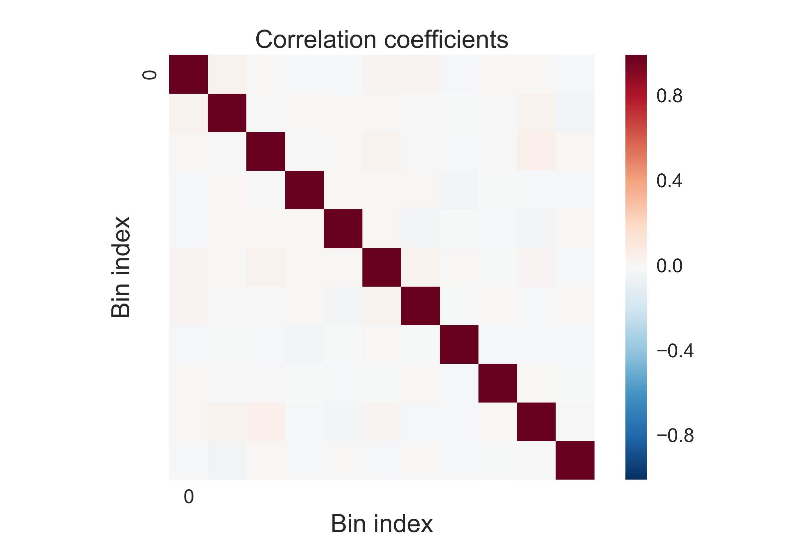

As expected, there was almost zero correlation between Z slices. This, this test for independence seemed reliable, and we concluded that there was some level of correlation between adjacent Z slices.

### Testing Identical Distributions
We tested whether the bins were identically distributed by determining the optimal number of clusters using GMM:

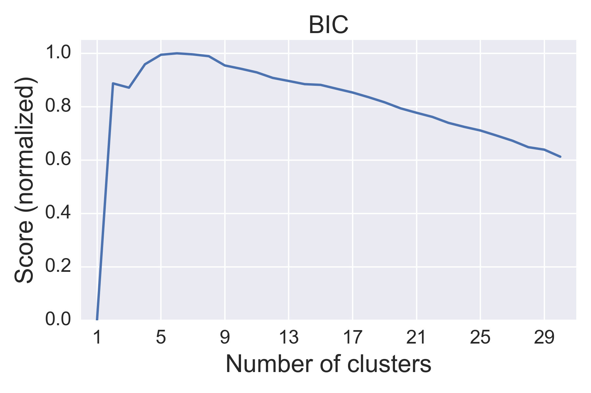

The optimal number of clusters was 6, which told us that the bins were not distributed under a single Gaussian distribution. We clustered the data into 6 groups:

When we look at the distribution of the 6 groups, however, we see that they don't appear to be distinct distributions:

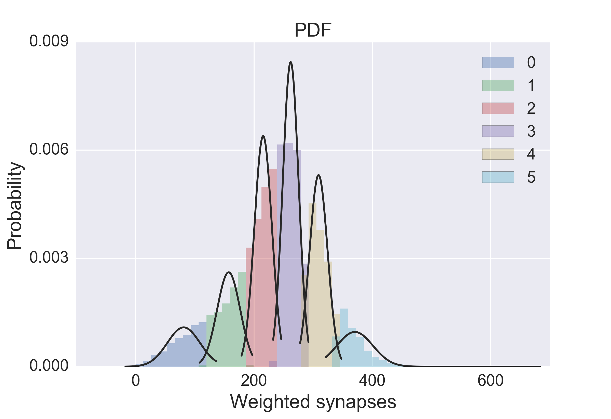

The optimal cluster size of 6 likely arose because the distribution of weighted synapses per bin is not Gaussian. However, separating the data by density provided a useful way to visualize the data, which we did in the following section.

## Visualizing the Data
We used the K-means clustered data to visualize the 3D distribution of synapse density:

### Group 0

### Group 1

### Group 2

### Group 3

### Group 4

### Group 5

There appeared to be two areas of high synapse density at low and high X coordinates.

## 3D Clustering
We used DBSCAN to find 3D clusters by synapse density. The algorithm found 142 total clusters, most of which were small clusters of only a few points. There were two large clusters (>5000 points).

This confirmed our hypothesis that there are two regions of high synapse density.

## Finding Trends in the Data

### Linear Trends in 1D
We examined the distribution of weighted synapses along the X, Y, and Z coordinates and assessed these distributions for any linear trends.

#### X coordinate
In the X dimension, there was a very small trend in X, with synapse density increasing at higher X-coordinates:

There appeared to be a nonlinear trend, with a slight U-shaped dependence in X, consistent with what was observed earlier in the [3D plots](#group-5).

#### Y coordinate
There was a noticeable trend in Y, with synapse density decreasing as Y increased:

#### Z coordinate
There was no appreciable trend in Z:

### Fitting in 2D
We looked at whether there were trends in the X-Y plane by fitting to the means of each X-Y coordinate (seen from 2 angles):

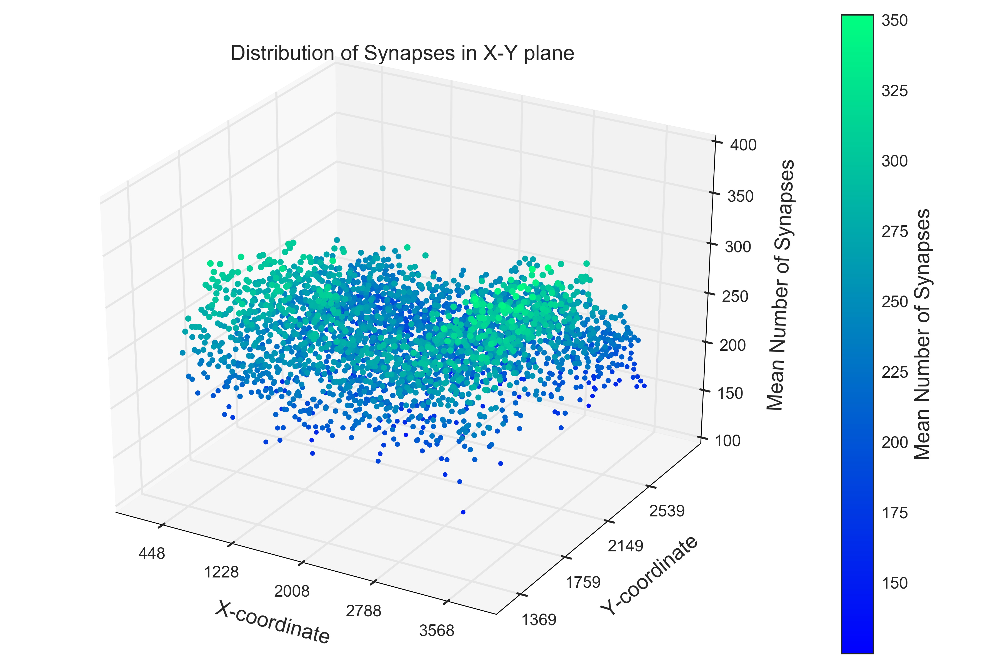

We tested polynomial fits of degree 0-4, as well as logarithmic and powerlaw models. The reduced chi-squared values are shown below.

<table>
<thead>
<tr class="header">
<th align="center">Model</th>
<th align="center">Reduced chi-squared value</th>
</tr>
</thead>
<tbody>
<tr class="odd">
<td align="center">Polynomial, degree=0</td>
<td align="center">642.81</td>
</tr>
<tr class="even">
<td align="center">Polynomial, degree=1</td>
<td align="center">478.14</td>
</tr>
<tr class="odd">
<td align="center">Polynomial, degree=2</td>
<td align="center">410.85</td>
</tr>
<tr class="even">
<td align="center">Polynomial, degree=3</td>
<td align="center">456.19</td>
</tr>
<tr class="odd">
<td align="center">Polynomial, degree=4</td>
<td align="center">1643.47</td>
</tr>
<tr class="even">
<td align="center">Logarithmic</td>
<td align="center">500.62</td>
</tr>
<tr class="odd">
<td align="center">Power Law</td>
<td align="center">506.92</td>
</tr>
</tbody>
</table>

The quadratic model gave the best fit.

#### Quadratic Fitting

The quadratic fit is viewed in 3D from two angles:

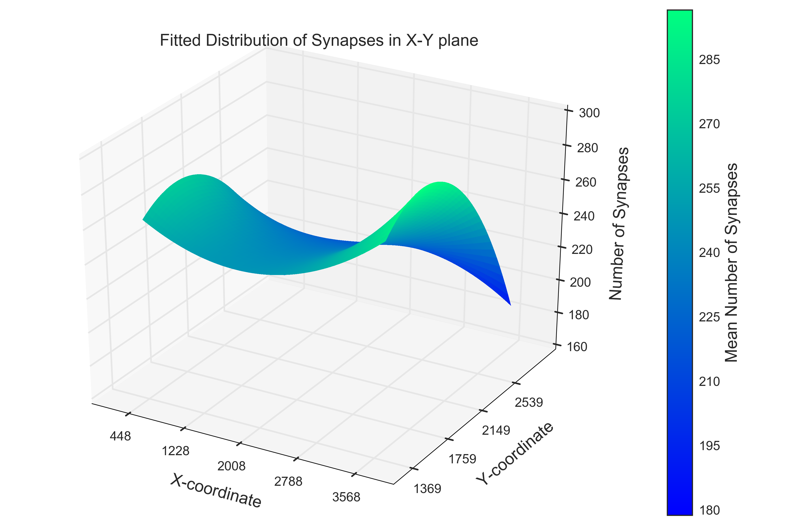

The fitted function showed a U-shaped dependence of synapse density in X for smaller Y-coordinates, and synapse density decreasing in Y, as observed earlier.

##### Residual Analysis

When we visually compare the fitted and actual data, the quadratic fit looks decent:

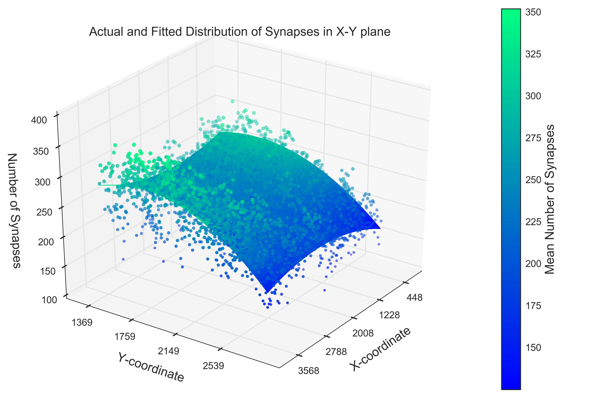

The residuals look fairly normal:

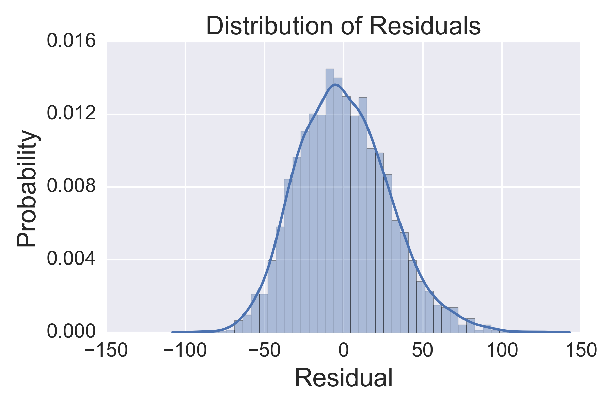

And there are no noticeable trends in X or Y:

This tells us that the quadratic fit is capturing the shape of our data quite well.

### Fitting in 1D
We similarly fit the data in 1D, to the means along each coordinate (X, Y, or Z).

#### Fitting to X means
We tested 0-4 degree polynomial fits as well as logarithmic and power law fits.

<table>
<thead>
<tr class="header">
<th align="center">Model</th>
<th align="center">Reduced chi-squared value</th>
</tr>
</thead>
<tbody>
<tr class="odd">
<td align="center">Polynomial, degree=0</td>
<td align="center">155.66</td>
</tr>
<tr class="even">
<td align="center">Polynomial, degree=1</td>
<td align="center">110.71</td>
</tr>
<tr class="odd">
<td align="center">Polynomial, degree=2</td>
<td align="center">52.71</td>
</tr>
<tr class="even">
<td align="center">Polynomial, degree=3</td>
<td align="center">53.35</td>
</tr>
<tr class="odd">
<td align="center">Polynomial, degree=4</td>
<td align="center">37.16</td>
</tr>
<tr class="even">
<td align="center">Logarithmic</td>
<td align="center">133.82</td>
</tr>
<tr class="odd">
<td align="center">Power Law</td>
<td align="center">133.26</td>
</tr>
</tbody>
</table>

Polynomial with degree = 4 gave the best fit.

##### Quartic Fitting in X
The results for quartic fitting in X are shown below.

The residuals don't look too bad, although they're not quite normal. With degree=4, we might be overfitting the data.

##### Quadratic Fitting in X

The results for quadratic fitting in X are shown below.

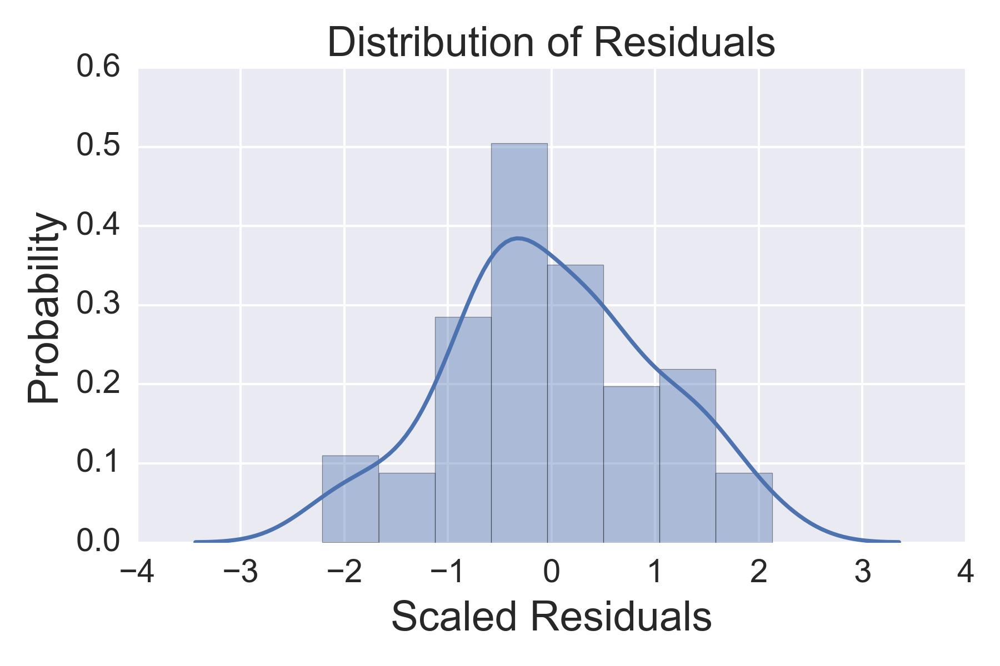

The residuals don't look too bad, although they're not quite normal. The U-shaped trend in X is consistent with our earlier analyses.

#### Fitting to Y means
We tested 0-4 degree polynomial fits as well as logarithmic and power law fits.

<table>
<thead>
<tr class="header">
<th align="center">Model</th>
<th align="center">Reduced chi-squared value</th>
</tr>
</thead>
<tbody>
<tr class="odd">
<td align="center">Polynomial, degree=0</td>
<td align="center">365.17</td>
</tr>
<tr class="even">
<td align="center">Polynomial, degree=1</td>
<td align="center">76.07</td>
</tr>
<tr class="odd">
<td align="center">Polynomial, degree=2</td>
<td align="center">36.48</td>
</tr>
<tr class="even">
<td align="center">Polynomial, degree=3</td>
<td align="center">32.26</td>
</tr>
<tr class="odd">
<td align="center">Polynomial, degree=4</td>
<td align="center">30.26</td>
</tr>
<tr class="even">
<td align="center">Logarithmic</td>
<td align="center">99.89</td>
</tr>
<tr class="odd">
<td align="center">Power Law</td>
<td align="center">109.26</td>
</tr>
</tbody>
</table>

Polynomial with degree = 4 gave the best fit (potential overfitting).

##### Quartic Fitting in Y

The results for quartic fitting in Y are shown below.

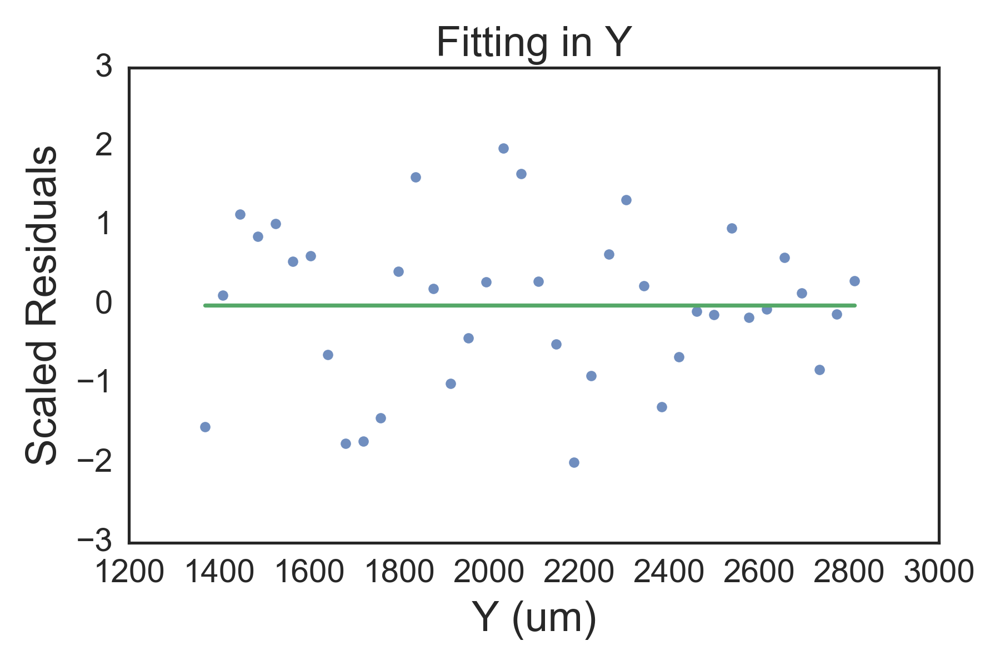
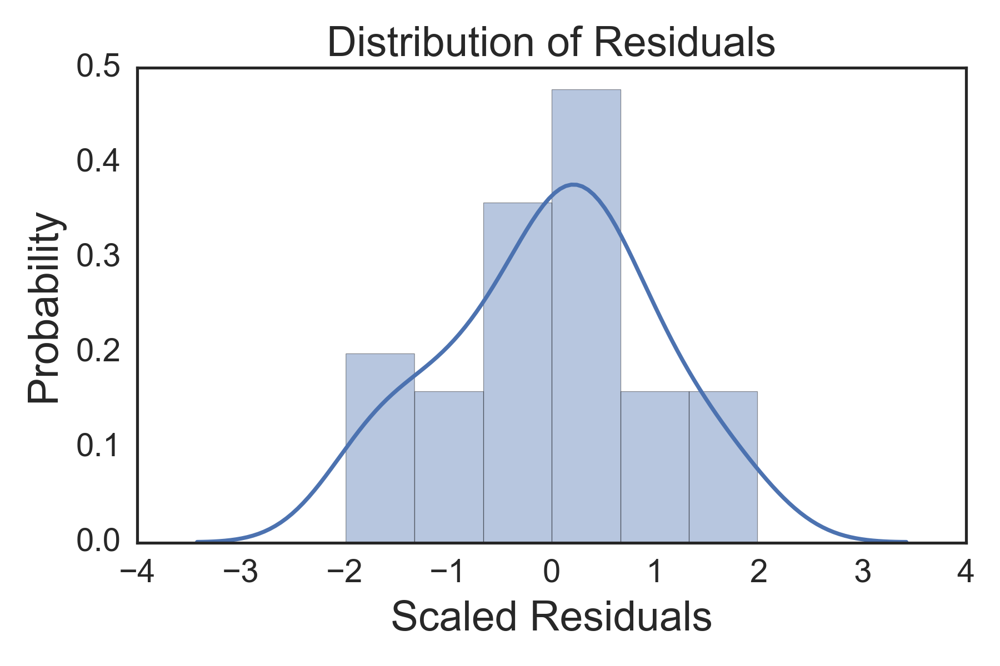

The residuals don't look too bad, although they're not quite normal. The downward trend in Y is consistent with our earlier analyses.

##### Quadratic Fitting in Y

The results for quadratic fitting in Y are shown below.

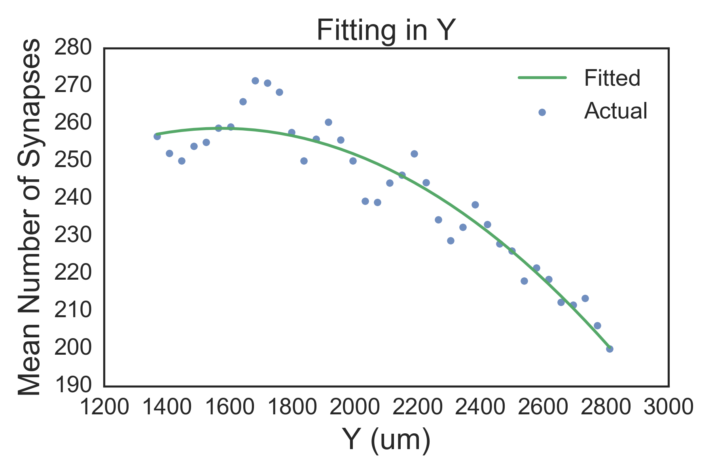
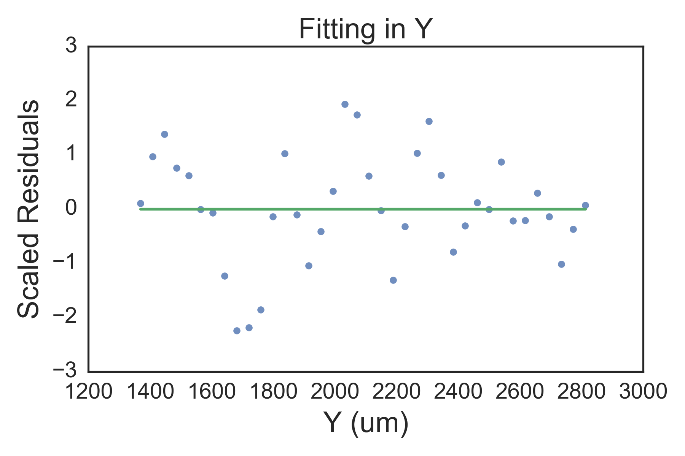

The residuals don't look too bad, although they're not quite normal. The downward trend in Y is consistent with our earlier analyses.

#### Fitting to Z means
We tested 0-4 degree polynomial fits as well as logarithmic and power law fits.

<table>
<thead>
<tr class="header">
<th align="center">Model</th>
<th align="center">Reduced chi-squared value</th>
</tr>
</thead>
<tbody>
<tr class="odd">
<td align="center">Polynomial, degree=0</td>
<td align="center">462.86</td>
</tr>
<tr class="even">
<td align="center">Polynomial, degree=1</td>
<td align="center">507.62</td>
</tr>
<tr class="odd">
<td align="center">Polynomial, degree=2</td>
<td align="center">270.16</td>
</tr>
<tr class="even">
<td align="center">Polynomial, degree=3</td>
<td align="center">299.75</td>
</tr>
<tr class="odd">
<td align="center">Polynomial, degree=4</td>
<td align="center">349.34</td>
</tr>
<tr class="even">
<td align="center">Logarithmic</td>
<td align="center">502.41</td>
</tr>
<tr class="odd">
<td align="center">Power Law</td>
<td align="center">503.82</td>
</tr>
</tbody>
</table>

Polynomial with degree = 2 gave the best fit.

##### Quadratic Fitting in Z

The results for quadratic fitting in Z are shown below.

The fit isn't very good, but there aren't many Z values to fit over.

##Conclusions
There were two regions of high synapse density that led to some interesting trends in X and Y, which may be worth exploring further. Trends in Z were harder to evaluate due to the low number of samples in Z.
