Table of Contents:

------------------------------------------------------------------------

-   [Overview](#overview)
-   [Exploring the Data](#exploring-the-data)
    -   [Data set contents](#data-set-contents)
    -   [Statistics](#statistics)
    -[Exploritory Analysis - Raw Synapse Count](#exploritory-analysis-raw-synapse-count)
       - [Distribution of Synapses](#distribution-of-synapses)
       - [1-Dimensional Marginal Distributions](#1-dimensional-marginal-distributions)
       - [2-Dimensional MarginalDistributions](#2-dimensional-marginal-distributions)
    - [Exploratory Analysis - Weighted Synaptic Count](#exploratory-analysis-weighted-synaptic-count)
       - [Distribution of Unmasked Count](#distribution-of-unmasked-count)
       - [Synapse vs. Unmasked](#synapse-vs-unmasked)
       - [Weighted Synapse](#weighted-synapse)
- [Hypothesis Testing](#hypothesis-testing)
    - [Statistical Test](#statistical-test)
         - [TestDefinition](#test-definition)
         - [Algorithm](#algorithm)
         - [Simulated Data](#simulated-data)
         - [Simulated Data Result](#simulated-data-result)
         - [Statistical Test on Weight Data](#statistical-test-on-weight-data)
- [Classification](#classification)
    - [Problem Definition](#problem-definition)
        - [Assumptions](#assumptions)
        - [Classification Problem](#classification-problem)
    - [Implementation / Setup](#implementation/setup)
        - [Example x-y grid](#example-x-y-grid)
        - [Grid Means by Z-layer](#grid-means-by-z-layer)
        - [Separating Z-layers into 2 groups](#separating-z-layers-into-two-groups)
        - [Grid Means Across the 2 Groups](#grid_means_across_2_groups)
    - [Classification Results](#classification-results)
        - [Accuracy of each classifier](#accuracy-of-each-classifier)
        - [Interpretation](#interpretation)
        
-   [Weighted Synapse Data](#weighted-synapse-data)
    -   [Testing Assumptions](#testing-assumptions)
        -   [Testing Independence](#testing-independence)
            -   [Independence of X-Y bins](#independence-of-x-y-bins)
            -   [Independence of Z slices](#independence-of-z-slices)
        -   [Testing Identical Distributions](#testing-identical-distributions)
    -   [Visualizing the Data](#visualizing-the-data)
        -   [Group 0](#group-0)
        -   [Group 1](#group-1)
        -   [Group 2](#group-2)
        -   [Group 3](#group-3)
        -   [Group 4](#group-4)
        -   [Group 5](#group-5)
    -   [3D Clustering](#3d-clustering)
    -   [Finding Trends in the Data](#finding-trends-in-the-data)
        -   [Linear Trends in 1D](#linear-trends-in-1d)
            -   [X coordinate](#x-coordinate)
            -   [Y coordinate](#y-coordinate)
            -   [Z coordinate](#z-coordinate)
        -   [Fitting in 2D](#fitting-in-2d)
            -   [Quadratic Fitting](#quadratic-fitting)
                -   [Residual Analysis](#residual-analysis)
        -   [Fitting in 1D](#fitting-in-1d)
            -   [Fitting to X means](#fitting-to-x-means)
                -   [Quartic Fitting in X](#quartic-fitting-in-x)
                -   [Quadratic Fitting in X](#quadratic-fitting-in-x)
            -   [Fitting to Y means](#fitting-to-y-means)
                -   [Quartic Fitting in Y](#quartic-fitting-in-y)
                -   [Quadratic Fitting in Y](#quadratic-fitting-in-y)
            -   [Fitting to Z means](#fitting-to-z-means)
                -   [Quadratic Fitting in Z](#quadratic-fitting-in-z)
    -   [Conclusions](#conclusions)

------------------------------------------------------------------------

Overview
--------

Systems neuroscience aims to fully map human connectome. Because of
studying neurons individually, traditional techniques cannot provide
information such as spatial distribution. Nowdays, electron microscopy
can map entire section of cortex in details. Therefore, we are able to
analyze the distribution in cortex. In this project, we have been
focusing on the density of synapses across the one specific
3D-dimensional layer of cortex.

## Exploring the Data

### Data set contents

The data set is a table consisting of the following columns: "cx", "cy", "cz", "unmasked", and "synapses". there are 61776 rows, each corresponding to a cortical volumn called "bins" henceforth. 

"cx", "cy", and "cz" denote the unique location of the bin. "synapses" is an integer count of the number of synapses found within the bin. 
Each bin was comprised of many individual voxels of the EM image. A synapse could technically be found at any given voxel. However, a subset of these voxels were pre-determined by the experimenters to contain material that are not synapses (i.e. cell bodies). These voxels were considered "masked". Thus the "unmasked" voxels comprise the subset area of each bin in which a synapse may reside. 

We found no values within our data set that were "bad": no NaNs, Infs or nonsensical values. All numbers were integers as expected. Synapses and unmasked values were nonnegative. 

### Statistics
* There are roughly  7.7e6 total synapses across the entire cortical volume
* The maximum number of synapses per bin is 507
* The mean number of synapses per bin is 124.7
* The median number of synapses per bin is 144
* The standard deviation of synapses per bin is 92.0
* The dimensions of each bin is 3.9 x 3.9 x 5.55 um^3
* The dimensions of the entire scanned cortical volume is 421.2 x 202.8 x 61.1 um^3

### Exploritory Analysis - Raw Synapse Count

#### Distribution of Synapses
Shown is a histogram of synapse count across all bins of the dataset.
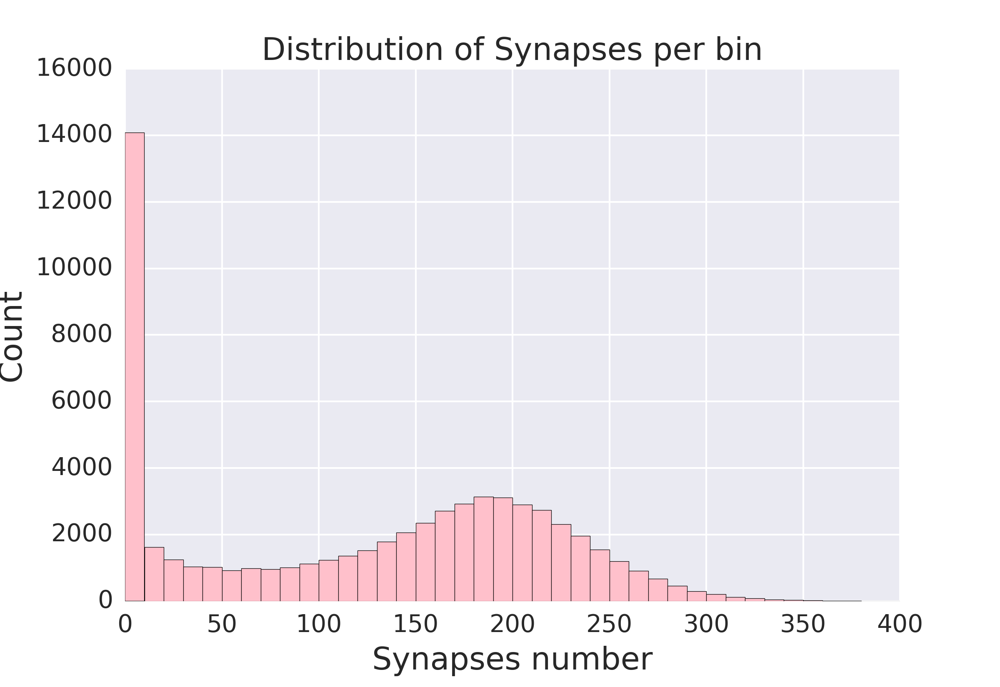
* There are a significant amount of zero or low-count bins. Later we realized that this was due to masking.
* Bins with higher synapse counts seem to be roughly normally distributed

To get a sense of outliers, we boxplotted synapse count.
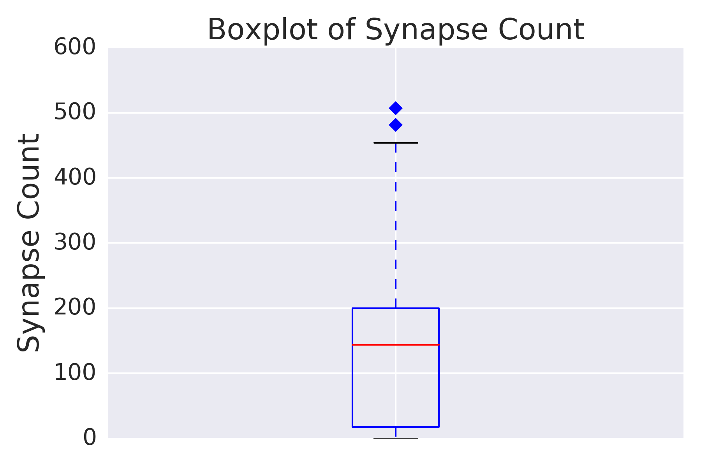
Only two bins were determined to be outliers.

#### 1-Dimensional Marginal Distributions
Shown are the marginal distributions of synapse count for along the cortical dimensions of x, y, and z
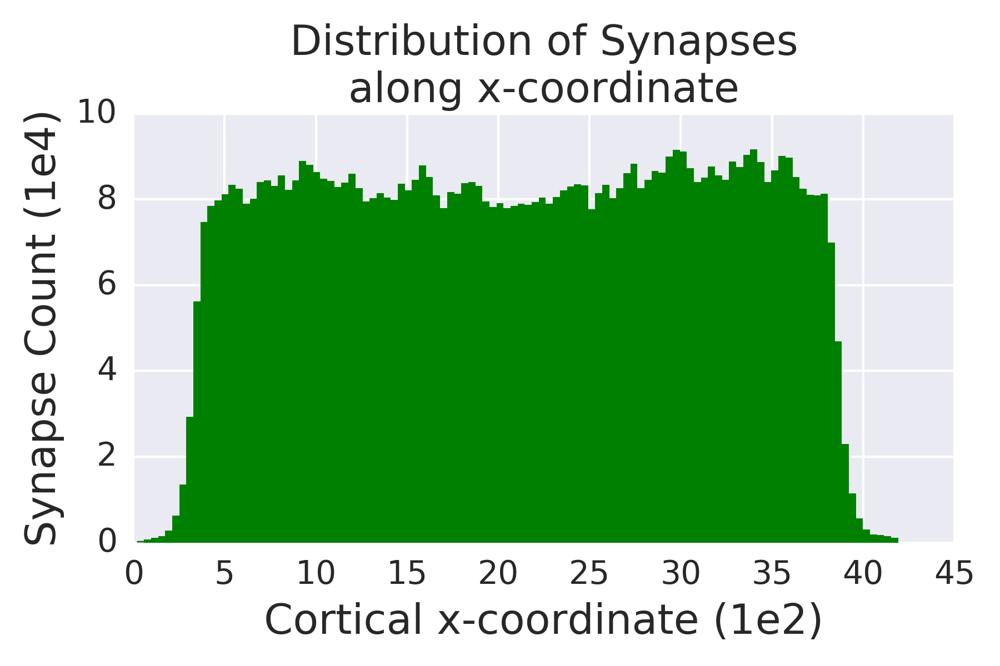
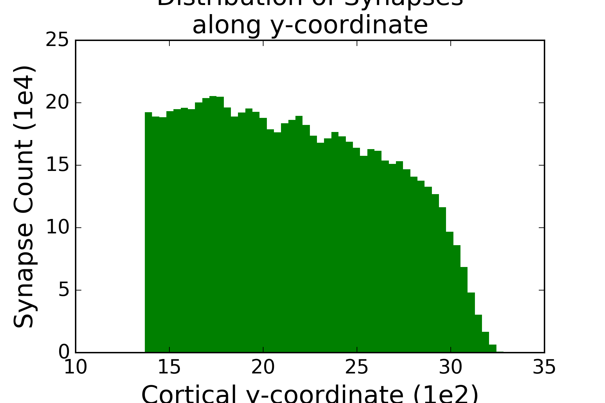
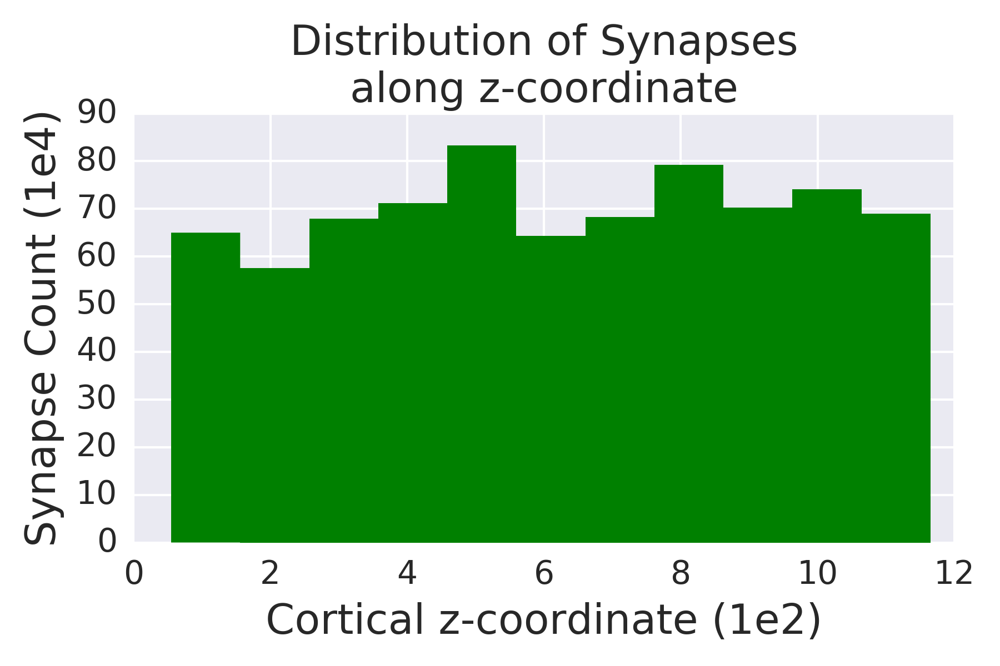
A couple observations are apparent:
* synapse count is relatively uniform across x and z dimensions 
* synapse count is not uniform across y dimension. The drop-off in synapse count at higher values of y is primarily due to edge effects of the data volume
* However, even away from the edges, there seems to be a slight negative trend beween synapse density and y-coordinate

#### 2-Dimensional Marginal Distributions
Shown are the heatmaps of synapse count.
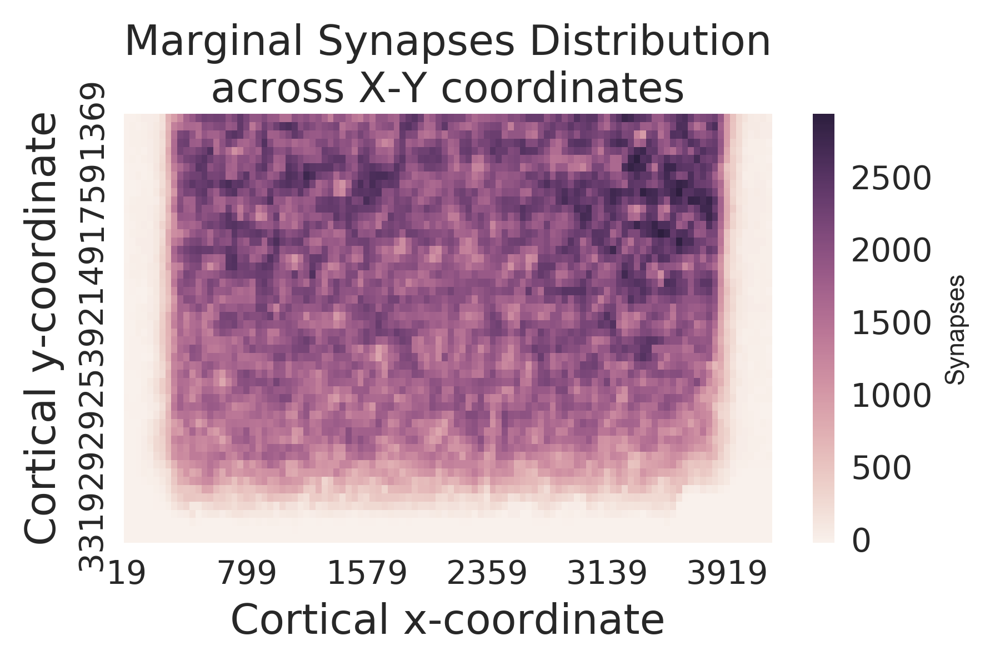
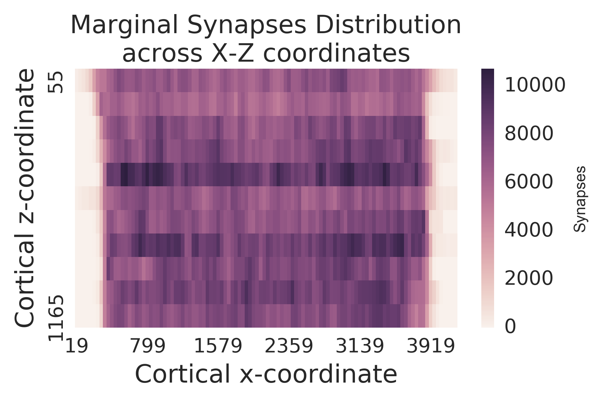
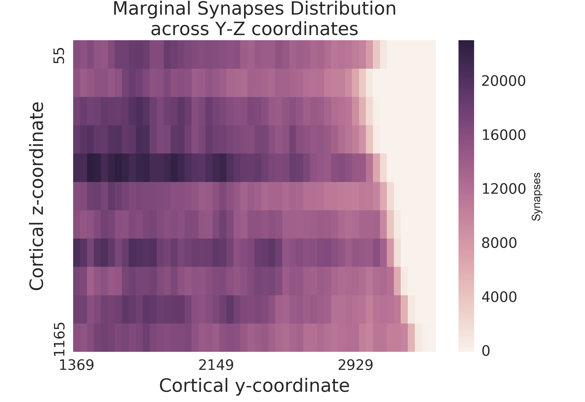
* The z-dimension is much courser than x and y. There are far less z-layers than x and y.
* The edge effects affecting the y-dimension distribution in the previous section are apparent in the y-z heatmap. Each Z layers had a variable edge cutoff in the y-dimension
* The x and z dimensions fairly "rectangular". There are significant edge effects here.
* Certain z-layers appear to be more dense than others. We investigate this further later.

### Exporatory Analysis - Weighted Synaptic Count
At this point, we realized the significance of the unmasked data. We incorporated unmasked considerations into our subsequent exploratory analysis.

#### Distribution of Unmasked Count
Shown is a box plot of the unmasked count:
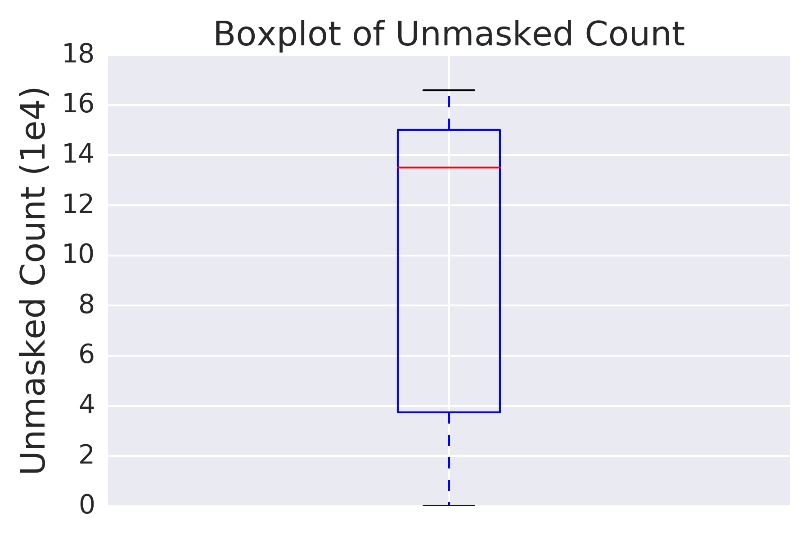
* There are no outliers 
* There is a lower tail

#### Synapse vs. Unmasked 
Shown is a joing plot of Synapse vs. unmasked data.
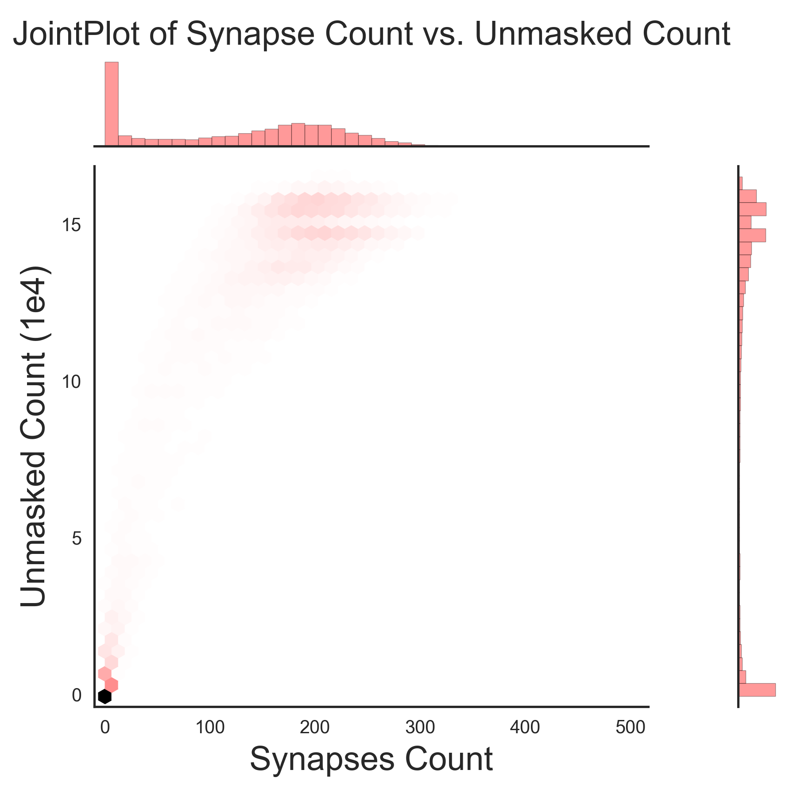
* note that the marginal distribution of synapse count is a repeat of what was shown before
* now we can appreciate the degree to which synapse count is affected by unmasked count. Virtually all the bins with zero-to-low synapse counts were the unmasked count also being zero-to-low
* There is an overall positive correlation between unmasked and synapse data, as one might expect. 
* Most of the data lies in a dense region of relatively high unmasked and synapse count. Within this region, there is less correlation between synapse and unmasked count.

#### Weighted Synapse
At this point we did two things with the data:
1) We defined "weighted" synapse count of a bin as the raw synapse count divided by the unmasked count
2) We discarded all bins with lower than 50% of voxels unmasked

Shown is the distribution of weighted synapses over all bins that met the 50% unmasked requirement:
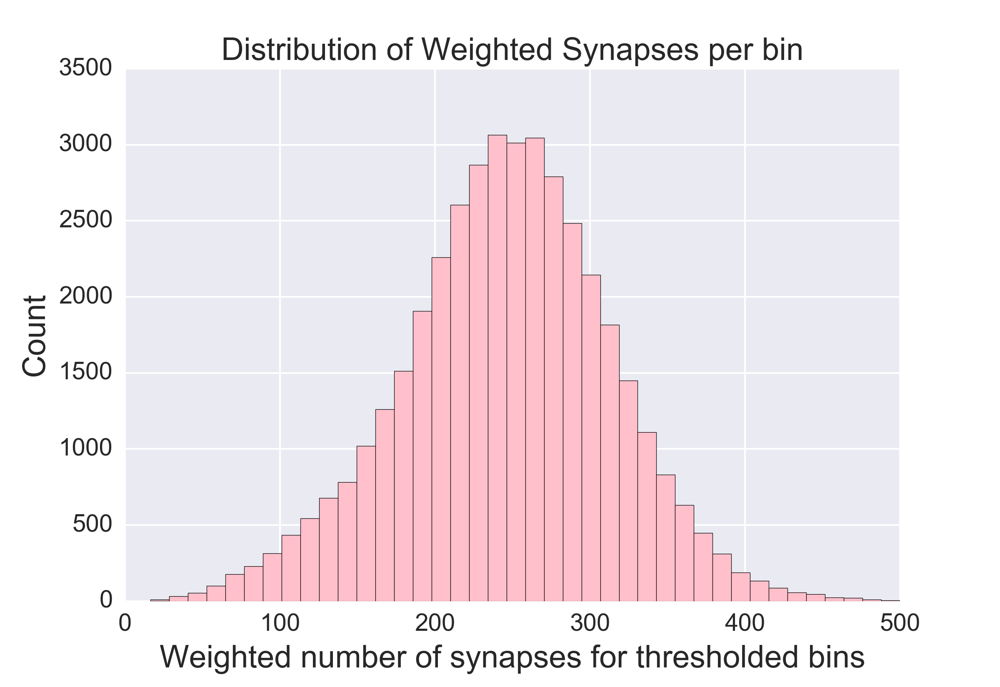
We have successfully pruned out the subset of bins with zero-to-low synapse/unmasked count. The remaining data looks fairly normally distributed.
All subsequent analysis was carried out with weighted and thresholded synapse count, and is referred to as "weighted synapse count".

## Hypothesis Testing

### Statistical Test
We decided to test whether the weighted synapse count follows a poisson distribution. 

#### Test Definition

* $\lambda$ is average number of synapses per bin
* $X_i$ is the number of synapses in a 3D bin $i \in \{1, 2, ..., N\}$
* $\chi^2 = \sum{\frac{(Observed-Expected)^2}{Expected}}$
* $H_0$: $X_i$ is Poisson (with rate $\lambda$)
* $H_1$: $X_i$ is not Poisson

#### Algorithm
* Combine the tails and/or coarsen bins of $X_i$ histogram so that all cells have at least 5 observations (http://www.itl.nist.gov/div898/handbook/eda/section3/eda35f.htm)
* New histogram $O_j$ is the number of observations (3D bins) with $k$ synapses, where $k \in j^{th}$ cell, $j \in \{1,2,...,m\}$ (m total cells)
* Compute $E_j = \sum_{k \in cell(j)}{N\frac{\lambda^k exp(-\lambda)}{k!}}$, $j \in \{1,2,...,m\}$
* $\chi^2 = \sum_{j=1}^{m}{\frac{(O_j-E_j)^2}{E_j}}$
* Degrees of freedom = $m-2$
* Significance level $\alpha = 0.05$
* If $\chi^2 > \chi^2_{1-\alpha,m-2}$, we reject the null hypothesis.
* Otherwise, there is not sufficient evidence to conclude that $X_i$ is not Poisson.

#### Simulated Data
We simulated data from poisson as well as geometric distributions under a range of sample sizes. We tested each set of simulated data under th Null Hypothesis that the data set was a poisson distribution. Thus, data generated by a poisson process was considered the "Null Model", while data generated by a geometric distribution was considered the "Alt Model"

#### Simulated Data Result
Shown is a the power of our statistical test over a range of sample sizes

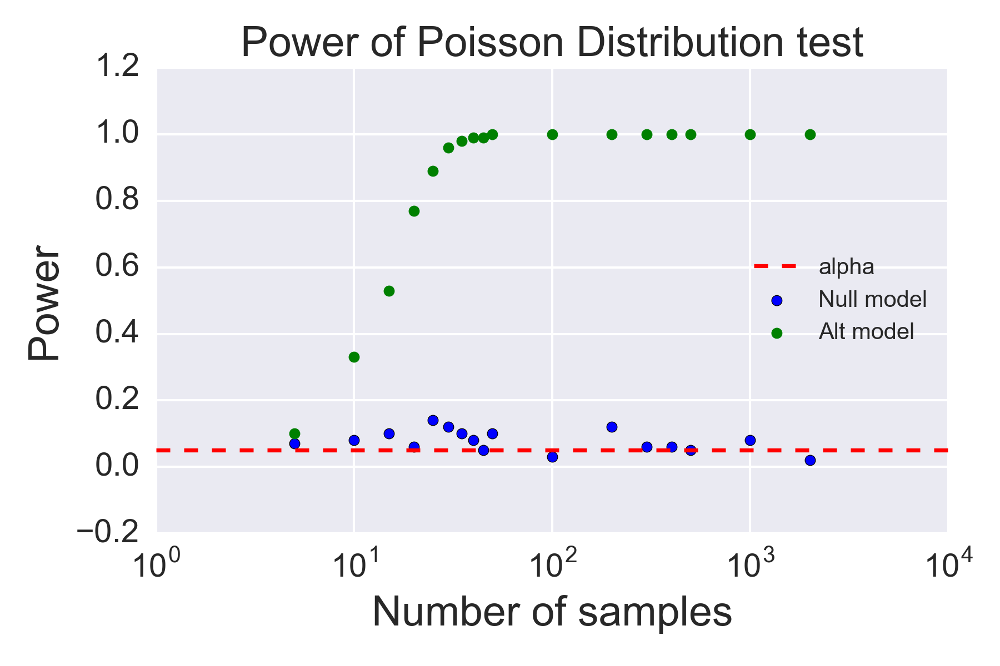

* As expected, data under the null model was rejected at alpha level over all sample sizes
* The power of our statistical test increased with sample size, approaching 1.0

#### Statistical Test on Weighted Data
We applied our test to our weighted synapse data by setting $\lambda$ to the observed mean of weighted synapse count. 

Shown is a comparison of the observed vs. expected weighted synapse counts:

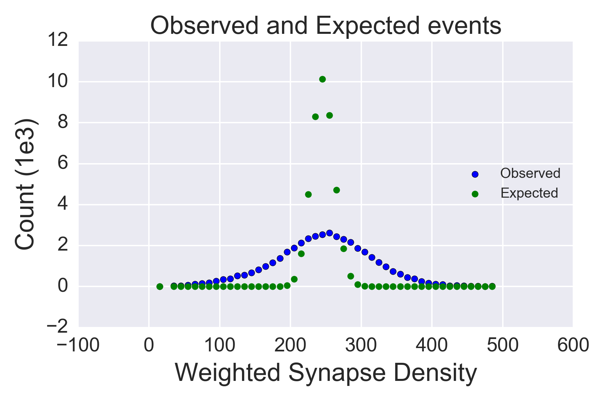

* chi-squared statistic:  inf
* p-value:  0.0
* Clearly the data was not poisson distributed
* We should have used a model with more than one degree of freedom (i.e. normal distribution). That way we could individually vary/fit a parameter for mean as well as a parameter for spread.

## Classification

### Problem Definition
We divided the bins according to Z layer, and attempted to classify the Z-layers based on weighted synapse count.

#### Assumptions
* The set of mean synapse density of an entire Z-layer can be classified into 2 groups: $W_i$
* $W_i = \{\text{High density},\text{  Low density}\}$  
* The distribution of synapse density of each group is normally distributed 

#### Classification Probelm
* We then randomly choose a small grid, and use the $X$ and $Y$ position to predict this grid belongs to high or low density.  
  
* $N$ is the number of synapses (observations)
* $X_i = X\text{ position} $  
* $Y_i = Y\text{ position} $  
* $H_0 = N \perp\!\!\!\perp X, Y$ positions
* $H_1 = N \text{ is not} \perp\!\!\!\perp X, Y$ positions  
* The objective is to minimize the expected error:  
* $E[l] = \sum_{n=1}^{\infty}I(\hat{W_i} \neq W_i)$ where $I$ is the indicator function.

Classification methods:

* lda (Linear Discriminant Analysis): No parameter.
* qda (Quadratic Discriminant Analysis): No parameter.
* svm (Support Vector Machine): Linear kernel, penalty parameter set to 0.001, to improve computation time.
* knn (K-Nearest Neighbours): Number of neighbors set to 3.
* rf (Random Forest): Default values except maximum depth set to 5.

### Implementation / Setup

#### Example x-y grid
Shown is an example of a 5-by-5 grid of bins.

We average the weighted synapse density across the 25 bins to produce a single "grid mean". 

#### Grid Means by Z-layer,
We randomly sample 1000 grids from each Z-layer and visualize the distribution of grid means

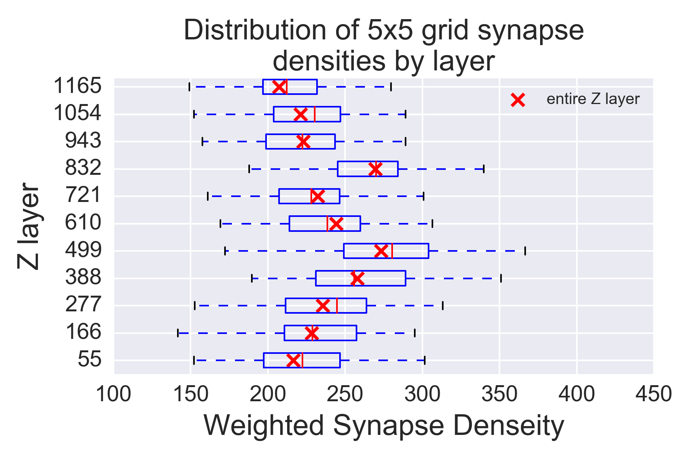

#### Separating the Z-layers into 2 Groups
We then took the means of the grid-means of each Z-layer (to have 11 means total), and performed K-means clustering to isolate two groups: one "high-response" group and one "low-response" group.

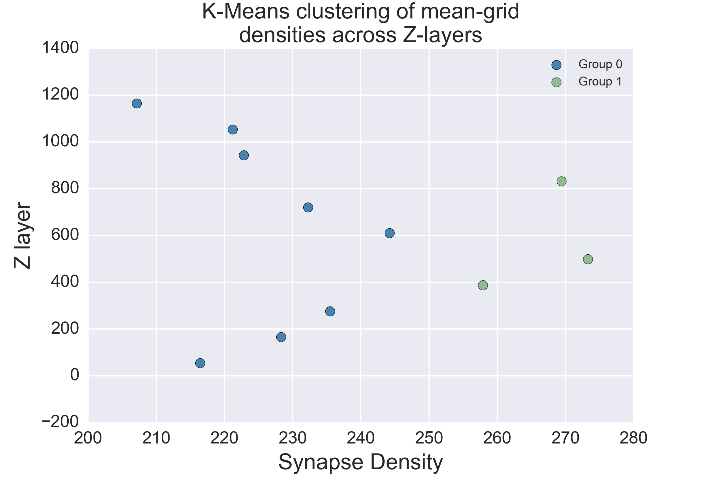

The low-response group comprised of 8 Z-layers, while the high-response group comprised of 3 Z-layers

#### Grid Means Across the 2 Groups
Shown is the distribution of grid-means of each group

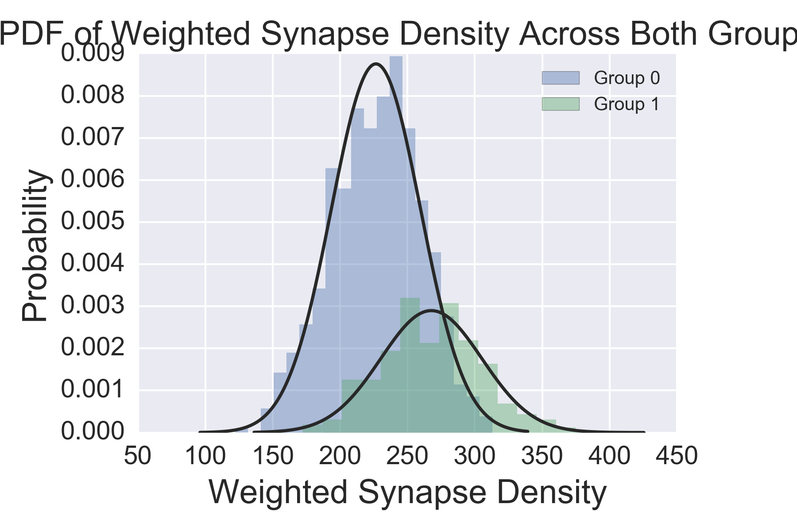

It is immediately obvious that the two groups have a significant overlap in grid means.  Classification is not expected to be very successful.

### Classification Results

#### Accuracy of each classifier
Accuracy of Nearest Neighbors: 0.75 (+/- 0.01)
Accuracy of Linear SVM: 0.80 (+/- 0.01)
Accuracy of Random Forest: 0.80 (+/- 0.01)
Accuracy of Linear Discriminant Analysis: 0.80 (+/- 0.01)
Accuracy of Quadratic Discriminant Analysis: 0.80 (+/- 0.01)

#### Interpretation
The five classifiers tested had accuracies between 75-80%, which is better than chance. However, these numbers are only slightly at or above the maximum prior probability of 73%. This means that our classifiers are only slightly better than just choosing the class with the maximum prior 100% of the time, assuming we trust the priors. Taking into account the observed synapse density provides little added information, which is not surprising given the large overlap in observed densities from the two classes. If we wanted to distinguish between similar populations of Z layers but with different priors from another dataset, our accuracy would decrease accordingly.

Weighted Synapse Data
---------------------
We decided to focus on analyzing the weighted synapse data with edges removed.

## Testing Assumptions
The first step was to test our assumptions about the data.

### Testing Independence
We tested independence in two ways: looking at independence between X-Y bins, and between Z slices.

#### Independence of X-Y bins
We looked at the correlation between X-Y bins, across Z:

Clearly, there were correlations in the off-diagonals. However, to evaluate the significance of this result, we also simulated data under the null hypothesis (that the data are uncorrelated). We generated random values for each bin using a normal distribution with the same mean and standard deviation as the data, and calculated the correlations:

There did appear to be larger correlations present in the actual data as compared to the null data (more red areas indicate more positively correlated X-Y bins). However, there were also correlations present in the off-diagonals of the simulated null data, indicating that this might not be a very good test for independence, since the number of samples across Z was quite small (11).

#### Independence of Z slices
We looked at the correlation between Z slices, across X-Y bins:

Adjacent Z slices were positively correlated with each other, while non-adjacent Z slices had much smaller correlations. We also calculated the correlations for the simulated null data:

As expected, there was almost zero correlation between Z slices. This, this test for independence seemed reliable, and we concluded that there was some level of correlation between adjacent Z slices.

### Testing Identical Distributions
We tested whether the bins were identically distributed by determining the optimal number of clusters using GMM:

The optimal number of clusters was 6, which told us that the bins were not distributed under a single Gaussian distribution. We clustered the data into 6 groups:

When we look at the distribution of the 6 groups, however, we see that they don't appear to be distinct distributions:

The optimal cluster size of 6 likely arose because the distribution of weighted synapses per bin is not Gaussian. However, separating the data by density provided a useful way to visualize the data, which we did in the following section.

## Visualizing the Data
We used the K-means clustered data to visualize the 3D distribution of synapse density:

### Group 0

### Group 1
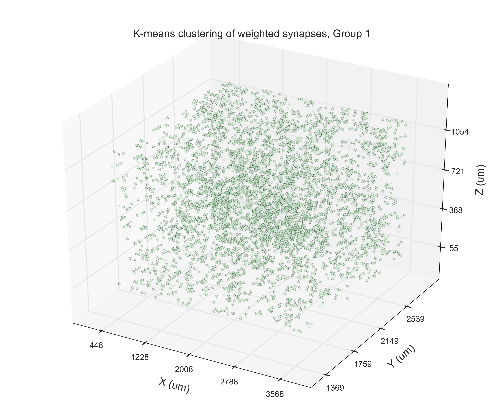
### Group 2

### Group 3

### Group 4
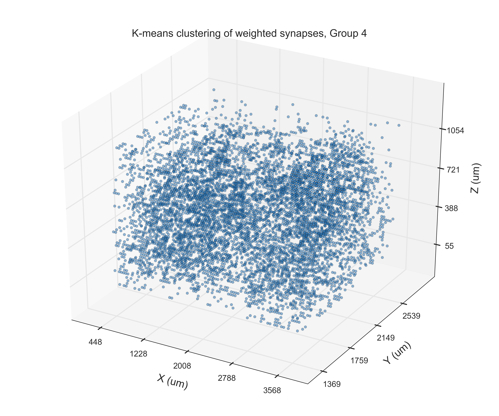
### Group 5

There appeared to be two areas of high synapse density at low and high X coordinates.

## 3D Clustering
We used DBSCAN to find 3D clusters by synapse density. The algorithm found 142 total clusters, most of which were small clusters of only a few points. There were two large clusters (>5000 points).

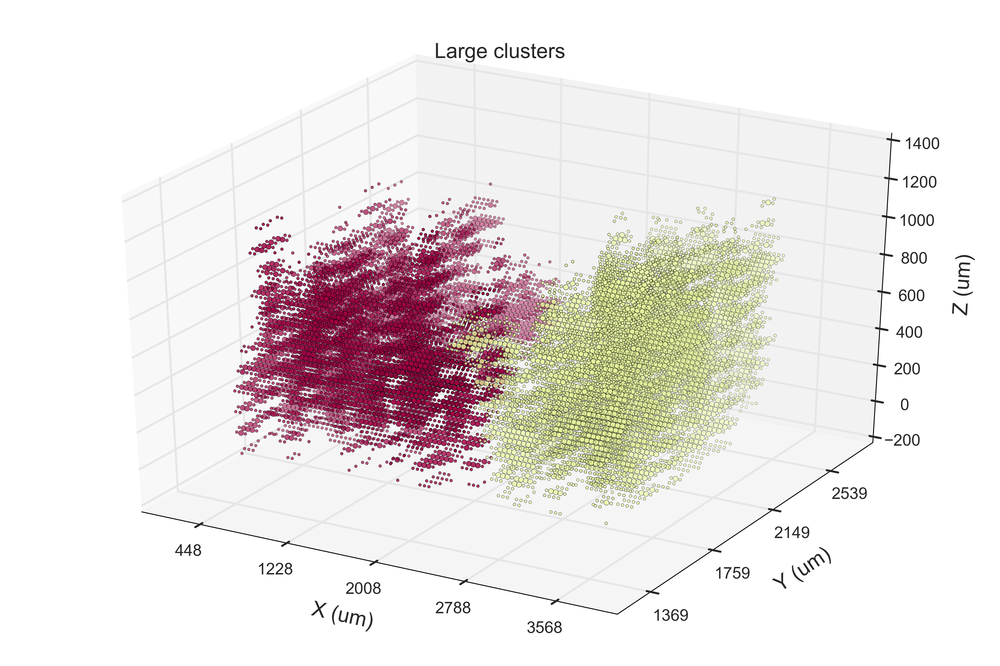
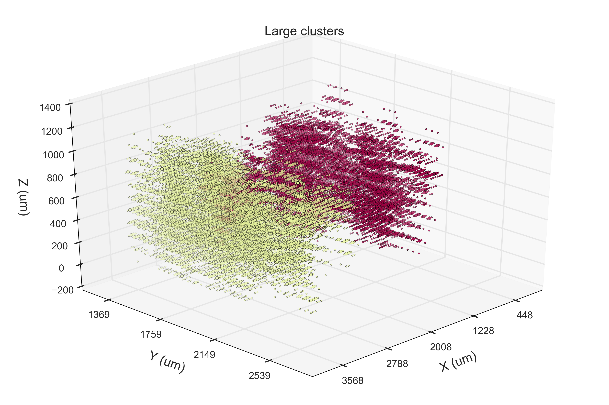

This confirmed our hypothesis that there are two regions of high synapse density.

## Finding Trends in the Data

### Linear Trends in 1D
We examined the distribution of weighted synapses along the X, Y, and Z coordinates and assessed these distributions for any linear trends.

#### X coordinate
In the X dimension, there was a very small trend in X, with synapse density increasing at higher X-coordinates:

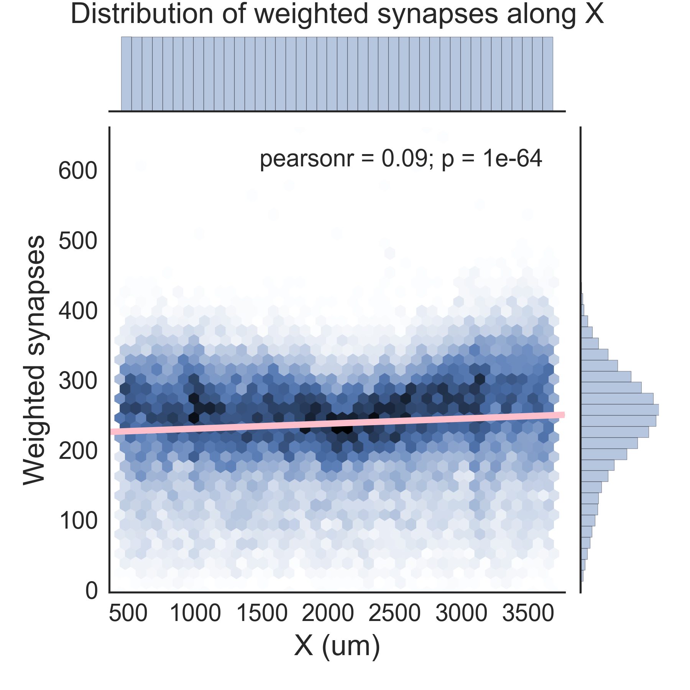

There appeared to be a nonlinear trend, with a slight U-shaped dependence in X, consistent with what was observed earlier in the [3D plots](#group-5).

#### Y coordinate
There was a noticeable trend in Y, with synapse density decreasing as Y increased:

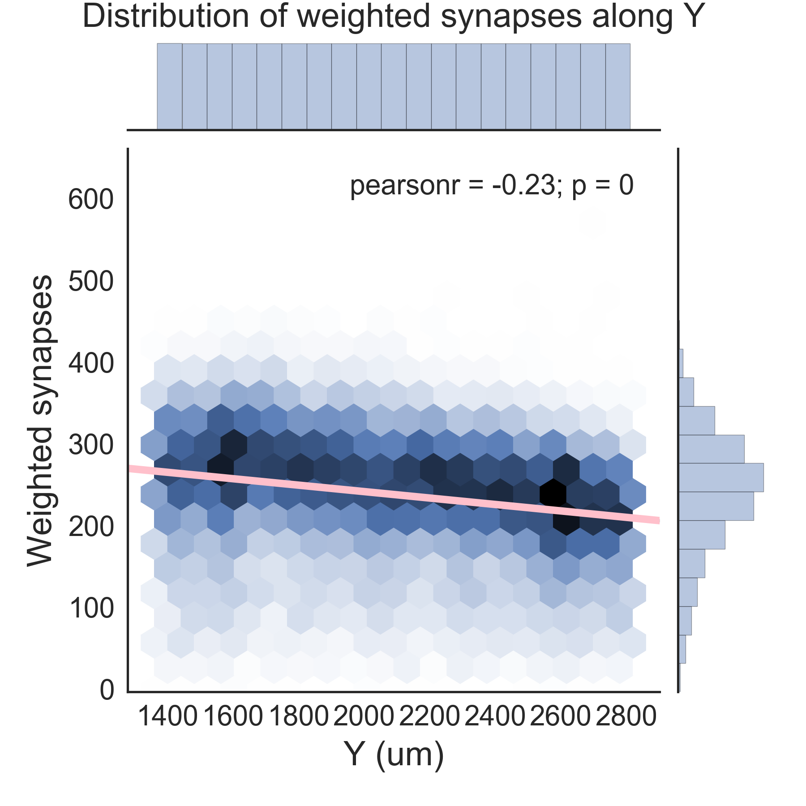

#### Z coordinate
There was no appreciable trend in Z:

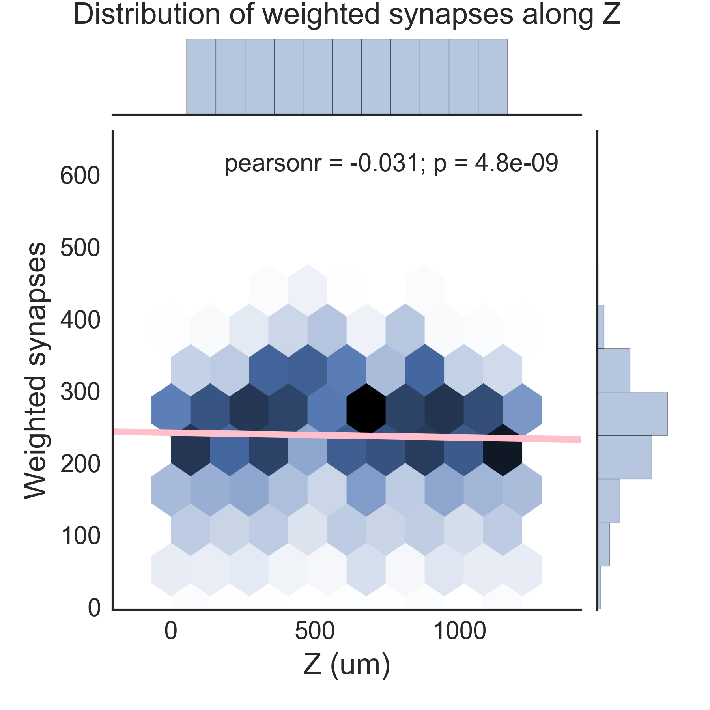

### Fitting in 2D
We looked at whether there were trends in the X-Y plane by fitting to the means of each X-Y coordinate (seen from 2 angles):

We tested polynomial fits of degree 0-4, as well as logarithmic and powerlaw models. The reduced chi-squared values are shown below.

<table>
<thead>
<tr class="header">
<th align="center">Model</th>
<th align="center">Reduced chi-squared value</th>
</tr>
</thead>
<tbody>
<tr class="odd">
<td align="center">Polynomial, degree=0</td>
<td align="center">642.81</td>
</tr>
<tr class="even">
<td align="center">Polynomial, degree=1</td>
<td align="center">478.14</td>
</tr>
<tr class="odd">
<td align="center">Polynomial, degree=2</td>
<td align="center">410.85</td>
</tr>
<tr class="even">
<td align="center">Polynomial, degree=3</td>
<td align="center">456.19</td>
</tr>
<tr class="odd">
<td align="center">Polynomial, degree=4</td>
<td align="center">1643.47</td>
</tr>
<tr class="even">
<td align="center">Logarithmic</td>
<td align="center">500.62</td>
</tr>
<tr class="odd">
<td align="center">Power Law</td>
<td align="center">506.92</td>
</tr>
</tbody>
</table>

The quadratic model gave the best fit.

#### Quadratic Fitting

The quadratic fit is viewed in 3D from two angles:

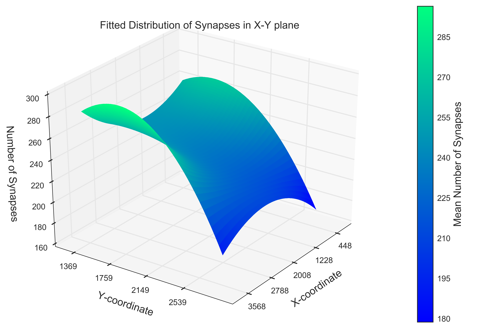

The fitted function showed a U-shaped dependence of synapse density in X for smaller Y-coordinates, and synapse density decreasing in Y, as observed earlier.

##### Residual Analysis

When we visually compare the fitted and actual data, the quadratic fit looks decent:

The residuals look fairly normal:

And there are no noticeable trends in X or Y:

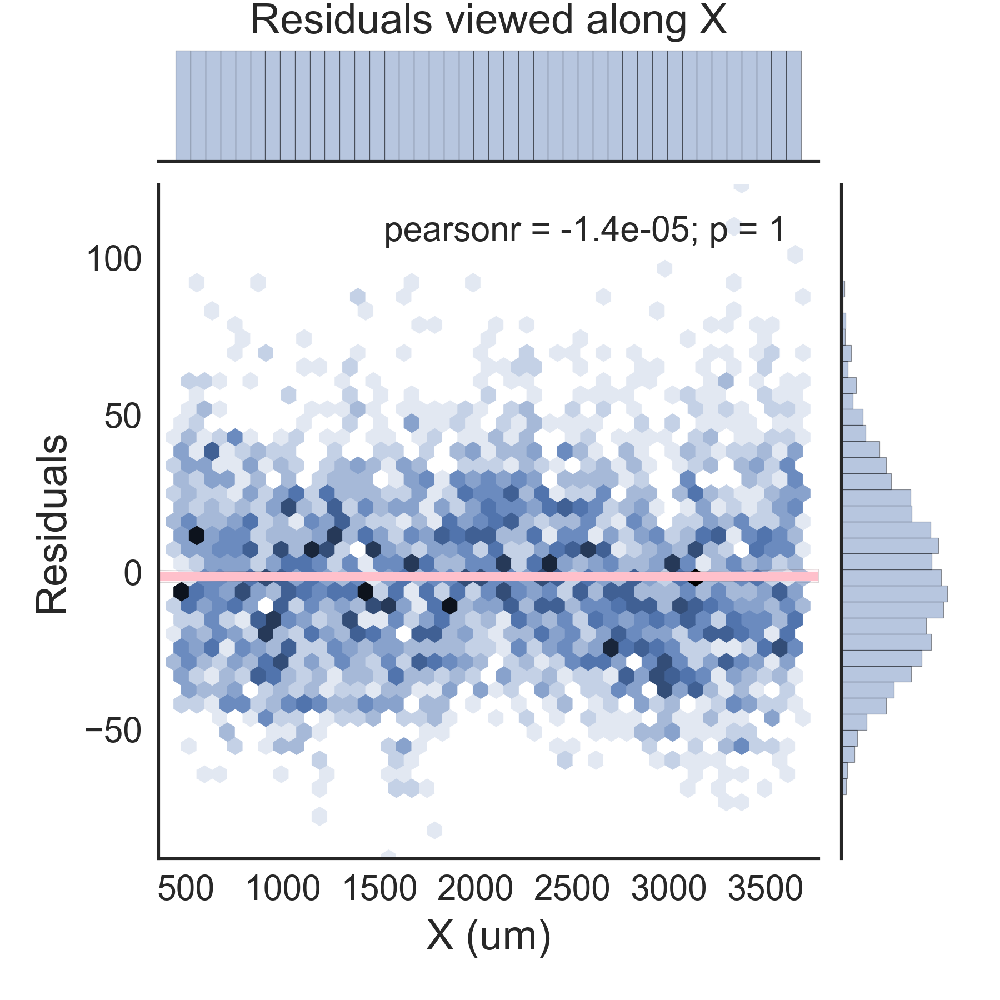

This tells us that the quadratic fit is capturing the shape of our data quite well.

### Fitting in 1D
We similarly fit the data in 1D, to the means along each coordinate (X, Y, or Z).

#### Fitting to X means
We tested 0-4 degree polynomial fits as well as logarithmic and power law fits.

<table>
<thead>
<tr class="header">
<th align="center">Model</th>
<th align="center">Reduced chi-squared value</th>
</tr>
</thead>
<tbody>
<tr class="odd">
<td align="center">Polynomial, degree=0</td>
<td align="center">155.66</td>
</tr>
<tr class="even">
<td align="center">Polynomial, degree=1</td>
<td align="center">110.71</td>
</tr>
<tr class="odd">
<td align="center">Polynomial, degree=2</td>
<td align="center">52.71</td>
</tr>
<tr class="even">
<td align="center">Polynomial, degree=3</td>
<td align="center">53.35</td>
</tr>
<tr class="odd">
<td align="center">Polynomial, degree=4</td>
<td align="center">37.16</td>
</tr>
<tr class="even">
<td align="center">Logarithmic</td>
<td align="center">133.82</td>
</tr>
<tr class="odd">
<td align="center">Power Law</td>
<td align="center">133.26</td>
</tr>
</tbody>
</table>

Polynomial with degree = 4 gave the best fit.

##### Quartic Fitting in X
The results for quartic fitting in X are shown below.

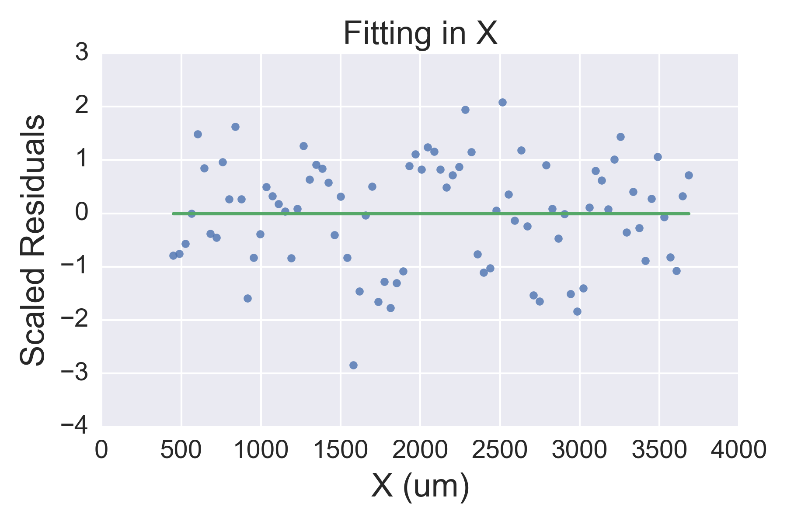

The residuals don't look too bad, although they're not quite normal. With degree=4, we might be overfitting the data.

##### Quadratic Fitting in X

The results for quadratic fitting in X are shown below.

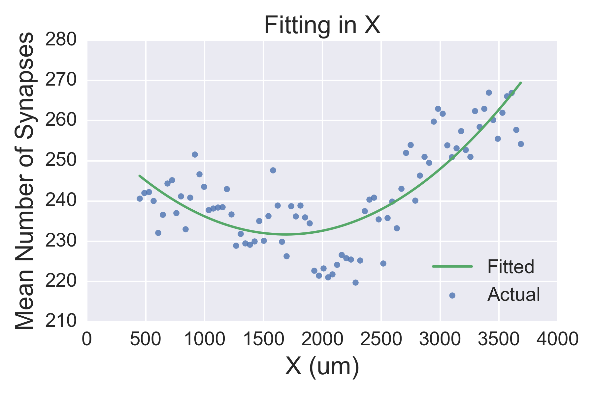
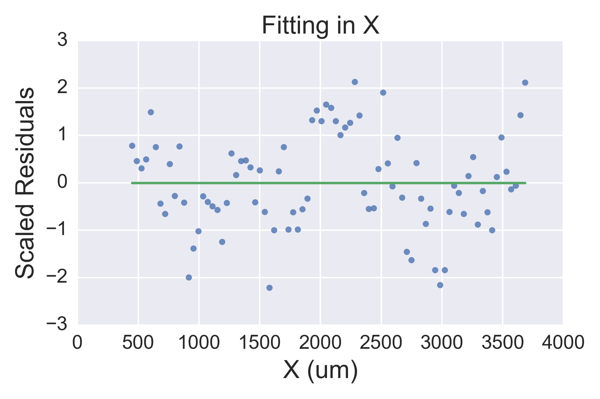

The residuals don't look too bad, although they're not quite normal. The U-shaped trend in X is consistent with our earlier analyses.

#### Fitting to Y means
We tested 0-4 degree polynomial fits as well as logarithmic and power law fits.

<table>
<thead>
<tr class="header">
<th align="center">Model</th>
<th align="center">Reduced chi-squared value</th>
</tr>
</thead>
<tbody>
<tr class="odd">
<td align="center">Polynomial, degree=0</td>
<td align="center">365.17</td>
</tr>
<tr class="even">
<td align="center">Polynomial, degree=1</td>
<td align="center">76.07</td>
</tr>
<tr class="odd">
<td align="center">Polynomial, degree=2</td>
<td align="center">36.48</td>
</tr>
<tr class="even">
<td align="center">Polynomial, degree=3</td>
<td align="center">32.26</td>
</tr>
<tr class="odd">
<td align="center">Polynomial, degree=4</td>
<td align="center">30.26</td>
</tr>
<tr class="even">
<td align="center">Logarithmic</td>
<td align="center">99.89</td>
</tr>
<tr class="odd">
<td align="center">Power Law</td>
<td align="center">109.26</td>
</tr>
</tbody>
</table>

Polynomial with degree = 4 gave the best fit (potential overfitting).

##### Quartic Fitting in Y

The results for quartic fitting in Y are shown below.

The residuals don't look too bad, although they're not quite normal. The downward trend in Y is consistent with our earlier analyses.

##### Quadratic Fitting in Y

The results for quadratic fitting in Y are shown below.

The residuals don't look too bad, although they're not quite normal. The downward trend in Y is consistent with our earlier analyses.

#### Fitting to Z means
We tested 0-4 degree polynomial fits as well as logarithmic and power law fits.

<table>
<thead>
<tr class="header">
<th align="center">Model</th>
<th align="center">Reduced chi-squared value</th>
</tr>
</thead>
<tbody>
<tr class="odd">
<td align="center">Polynomial, degree=0</td>
<td align="center">462.86</td>
</tr>
<tr class="even">
<td align="center">Polynomial, degree=1</td>
<td align="center">507.62</td>
</tr>
<tr class="odd">
<td align="center">Polynomial, degree=2</td>
<td align="center">270.16</td>
</tr>
<tr class="even">
<td align="center">Polynomial, degree=3</td>
<td align="center">299.75</td>
</tr>
<tr class="odd">
<td align="center">Polynomial, degree=4</td>
<td align="center">349.34</td>
</tr>
<tr class="even">
<td align="center">Logarithmic</td>
<td align="center">502.41</td>
</tr>
<tr class="odd">
<td align="center">Power Law</td>
<td align="center">503.82</td>
</tr>
</tbody>
</table>

Polynomial with degree = 2 gave the best fit.

##### Quadratic Fitting in Z

The results for quadratic fitting in Z are shown below.

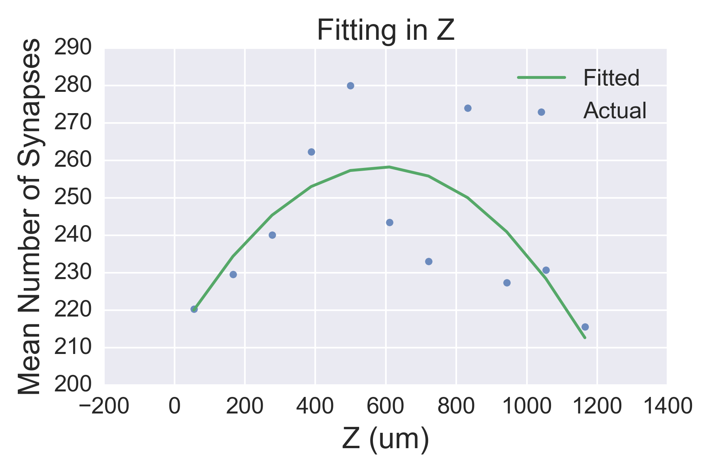
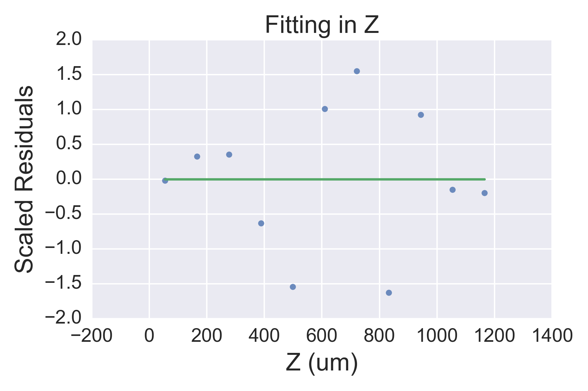
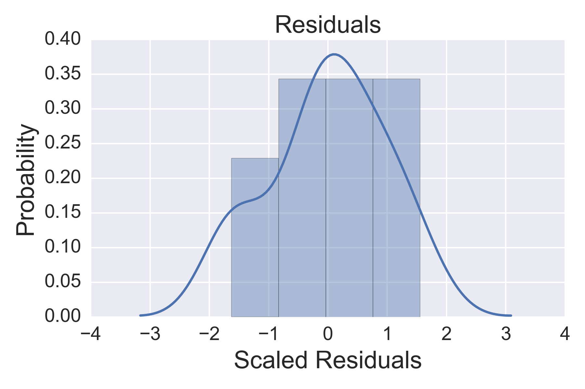

The fit isn't very good, but there aren't many Z values to fit over.

##Conclusions
There were two regions of high synapse density that led to some interesting trends in X and Y, which may be worth exploring further. Trends in Z were harder to evaluate due to the low number of samples in Z.
