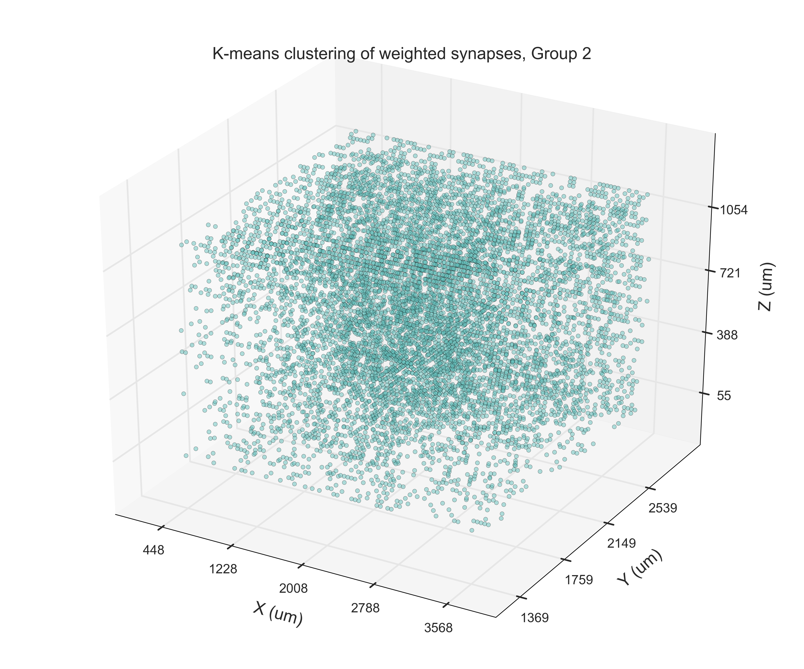

-   [Overview](#overview)
-   [Testing Assumptions](#testing-assumptions)  
-   [New Analysis](#new-analysis)
    -   [Visualize the Data with Edges
        Removed](#visualize-the-data-with-edges-removed)
        -   [X coordinate](#x-coordinate)  
        -   [Y coordinate](#y-coordinate)  
        -   [Z coordinate](#z-coordinate)  
    -   [Distribution of Data (1D)](#distribution-of-data-1d)
        -   [X coordinate](#x-coordinate-1)  
        -   [Y coordinate](#y-coordinate-1)  
        -   [Z coordinate](#z-coordinate-1)  
    -   [Distribution of Data (2D)](#distribution-of-data-2d)
        -   [X-Y coordinate](#x-y-coordinate)  
        -   [X-Z coordinate](#x-z-coordinate)  
        -   [Y-Z coordinate](#y-z-coordinate)  
    -   [3D Plot](#3d-plot)
        -   [3D plot of Weighted
            Synapses](#3d-plot-of-weighted-synapses)  
        -   [3D Plot with High-density](#3d-plot-with-high-density)  
        -   [3D Plot with Very
            High-density](#3d-plot-with-very-high-density)
    -   [3D Plot with different filter
        levels](#3d-plot-with-different-filter-levels)
        -   [Filter level = 0.7](#filter-level--07)  
        -   [Filter level = 0.8](#filter-level--08)  
    -   [Histogram of Weighted
        Synapses](#histogram-of-weighted-synapses)
    -   [Chi-squared Test for Uniform
        Distribution](#chi-squared-test-for-uniform-distribution)
    -   [Boxplot of Synapses](#boxplot-of-synapses)
    -   [Fourier Transform](#fourier-transform)
        -   [X-Y coordinate](#x-y-coordinate-1)  
        -   [X-Z coordinate](#x-z-coordinate-1)  
        -   [Y-Z coordinate](#y-z-coordinate-1)  
    -   [1-Way ANOVA at Z-layer](#1-way-anova-at-z-layer)  
    -   [Rank-sum test at Z-group](#rank-sum-Test-at-z-group)  
    -   [Checking Normality](##checking-normality)
        -   [Z-layer 1](#z-layer-1)  
        -   [Z-layer 2](#z-layer-2)  
        -   [Z-layer 3](#z-layer-3)  
        -   [Z-layer 4](#z-layer-4)  
        -   [Z-layer 5](#z-layer-5)  
        -   [Z-layer 6](#z-layer-6)  
    -   [Distribution of Y-layer](#distribution-of-y-layer)
        -   [Distribution of Y-group](#distribution-of-y-group)  
        -   [Density plot of Y-group](#density-plot-of-y-group)
            -   [Y-group 1](#y-group-1)  
            -   [Y-group 2](#y-group-2)  
            -   [Y-group 3](#y-group-3)  
            -   [Y-group 4](#y-group-4)  
    -   [1-way ANOVA at Y-group](#1-way-anova-at-y-group)  
    -   [Pairwised t-test at Y-group](#pairwised-t-test-at-y-group)  
    -   [Rank-sum test at Y-group](#rank-sum-Test-at-y-group)  
    -   [Assumption Checking](#assumption-checking)
        -   [Checking Normality](##checking-normality1)  
        -   [Identical testing](#identical-testing)  
        -   [Clustering](#clustering)  
        -   [Box plot](#box-plot)
    -   [Ordinary Least Square with Linear
        Model](#ordinary-least-square-with-linear-model)  
    -   [Trend along X/Y](#trend-along-xy)
        -   [Along X Coordinate](#along-x-coordinate)  
        -   [Along Y Coordinate](#along-y-coordinate)  
    -   [Blur Images with Gaussian
        Filter](#blurimages-with-gaussian-filter)
        -   [Sigma = 0](#sigma--0)  
        -   [Sigma = 1.5](#sigma--15)  
    -   [GLCM in Z-layer](#glcm-in-z-layer)
        -   [Level = 5](#level--5)  
        -   [Level = 40](#level--40)  
        -   [Pacth = 6](#patch--6)  
        -   [Pacth = 12](#patch--12)  
    -   [GLCM Properties](#glcm-properties)  
    -   [Entropy of Z-layer](#entropy-of-z-layer)
        -   [Disk = 5](#disk--5)  
        -   [Disk = 20](#disk--20)  
-   [Weighted Synapse Data](#weighted-synapse-data)
    -   [Testing Assumptions](#testing-assumptions)
        -   [Testing Independence](#testing-independence)
            -   [Independence of X-Y bins](#independence-of-x-y-bins)
            -   [Independence of Z slices](#independence-of-z-slices)
        -   [Testing Identical
            Distributions](#testing-identical-distributions)
    -   [Visualizing the Data](#visualizing-the-data)
        -   [Group 0](#group-0)
        -   [Group 1](#group-1)
        -   [Group 2](#group-2)
        -   [Group 3](#group-3)
        -   [Group 4](#group-4)
        -   [Group 5](#group-5)
    -   [3D Clustering](#3d-clustering)
    -   [Finding Trends in the Data](#finding-trends-in-the-data)
        -   [Linear Trends in 1D](#linear-trends-in-1d)
            -   [X coordinate](#x-coordinate)
            -   [Y coordinate](#y-coordinate)
            -   [Z coordinate](#z-coordinate)
        -   [Fitting in 2D](#fitting-in-2d)
            -   [Quadratic Fitting](#quadratic-fitting)
                -   [Residual Analysis](#residual-analysis)
        -   [Fitting in 1D](#fitting-in-1d)
            -   [Fitting to X means](#fitting-to-x-means)
                -   [Quartic Fitting in X](#quartic-fitting-in-x)
                -   [Quadratic Fitting in X](#quadratic-fitting-in-x)
            -   [Fitting to Y means](#fitting-to-y-means)
                -   [Quartic Fitting in Y](#quartic-fitting-in-y)
                -   [Quadratic Fitting in Y](#quadratic-fitting-in-y)
            -   [Fitting to Z means](#fitting-to-z-means)
                -   [Quadratic Fitting in Z](#quadratic-fitting-in-z)
    -   [Conclusions](#conclusions)

------------------------------------------------------------------------

Overview
--------

Systems neuroscience aims to fully map human connectome. Because of
studying neurons individually, traditional techniques cannot provide
information such as spatial distribution. Nowdays, electron microscopy
can map entire section of cortex in details. Therefore, we are able to
analyze the distribution in cortex. In this project, we have been
focusing on the density of synapses across the one specific
3D-dimensional layer of cortex.

Testing Assumptions
-------------------

In our analysis, we made a few assumptions about our data set:

-   `Unmasked` is independent of `weighted number of synapses`.  
-   `Weighted number of synapses` is independent of `X` and `Y`.
-   Bins are i.i.d.  
-   Means of grids are i.i.d.  
-   Class conditional difference between layers.

Therefore, it was time to examine our assumptions to see if they are
correct so that we may improve our model accordingly.

First, we tested the indepednce between `unmasked` and `weighted`. We
used different threshold to test the independece. As the table below
shows, it is obvious that the correlation drops as the threshold
increases. By thinking intuitively, this is not surprise because the
more masked region, the less observed synapses. Therefore if we cut out
those low threshold data, the correlation also decreases.

<table>
<thead>
<tr class="header">
<th align="center">Voxel threshold</th>
<th align="center">Correlation</th>
<th align="center">p-value</th>
</tr>
</thead>
<tbody>
<tr class="odd">
<td align="center">0 %</td>
<td align="center">0.7495</td>
<td align="center">0.0</td>
</tr>
<tr class="even">
<td align="center">5.0 %</td>
<td align="center">0.5835</td>
<td align="center">0.0</td>
</tr>
<tr class="odd">
<td align="center">10.0 %</td>
<td align="center">0.5319</td>
<td align="center">0.0</td>
</tr>
<tr class="even">
<td align="center">20.0 %</td>
<td align="center">0.4726</td>
<td align="center">0.0</td>
</tr>
<tr class="odd">
<td align="center">30.0 %</td>
<td align="center">0.4413</td>
<td align="center">0.0</td>
</tr>
<tr class="even">
<td align="center">50.0 %</td>
<td align="center">0.3513</td>
<td align="center">0.0</td>
</tr>
<tr class="odd">
<td align="center">70.0 %</td>
<td align="center">0.0188</td>
<td align="center">0.013</td>
</tr>
</tbody>
</table>

Secondly, we examined the whether the `X` and `Y` positions are
independent with `weighted`. From the table below we realized that the
`X` positions have little correlation with `weighted`. However, the `Y`
positions slightly correlate with `weighted`, which contradicts with our
previous assumption.

<table>
<thead>
<tr class="header">
<th align="center">Position</th>
<th align="center">Correlation</th>
<th align="center">p-value</th>
</tr>
</thead>
<tbody>
<tr class="odd">
<td align="center">X</td>
<td align="center">0.1227</td>
<td align="center">4.49e-05</td>
</tr>
<tr class="even">
<td align="center">Y</td>
<td align="center">-0.3552</td>
<td align="center">4.60e-34</td>
</tr>
</tbody>
</table>

Next, we tested whether these bins are independently sampled and
identically distributed. The figures below show the covariance matrix
and BIC score with GMM clustering. Since the content in the off-diagonal
is not 0 in the most part, it suggests that bins are not independent.
But the optimal number of cluster is 1, which suggests that they are
actually identically distributed.

Then, we examined the iid assumption of means of grid as a whole and in
Z-layer in particular. From the figures below, we see that the ratio of
on- and off- diagonal in the covariance matrix is very small, suggesting
that they are not independent. Since the optimal number of clusters is
1, we concluded the grid means are identical.

About the Z-layers, as the ratio of on- and off-diagonal determinants is
extremely large, we can conclude that they are independent in fact. But
since the optimal number of clusters is not 1, suggesting that the
Z-layers are not identically distributed.

Finally, we tested the conditional difference between high and low
density Z-layers. From the figure below, it clearly that the classifier
cannot distinguish grids just based on their means. Therefore this
assumption is false.

New Analysis
============

After spring break, new analysis started.

Visualize the Data with Edges Removed
-------------------------------------

First of all, we remove the edges and reexamine the data.

### X coordinate

### Y coordinate

### Z coordinate

Distribution of Data (1D)
-------------------------

### X coordinate

### Y coordinate

### Z coordinate

Distribution of Data (2D)
-------------------------

These plots are examining the data in 2-dimension.

### X-Y coordinate

### X-Z coordinate

### Y-Z coordinate

3D Plot
-------

These plots are examining the data in 3-dimension.

### 3D plot of Weighted Synapese

### 3D Plot with High-density

### 3D Plot with Very High-density

Histogram of Weighted Synapses
------------------------------

We ploted the histogram using the whole data set.

3D Plot with different filter levels
------------------------------------

Also, we used different filter levels to look art the data.

### Filter level = 0.7

### Filter level = 0.82

We tested whether the distribution of synapses follows uniform
distribution, but, obviously the p-value is nearly 0. Therefore, we
rejected this hypothesis. Synapses are not uniformly distributed.

Boxplot of Synapses
-------------------

We used boxplot try to examine whether there is the existence of
outlier, and the answer is not.

Fourier Transform
-----------------

Just for a try, we used Fourier transform to look at the data.

### X-Y coordinate

### X-Z coordinate

### Y-Z coordinate

1-Way ANOVA at Z-layer
----------------------

By using filter levels = 0.8, there are only 6 different Z-layers. So we
used 1-way ANOVA to test whether the mean of each Z-layer are different.
With the p-value is nearly 0, we may conclude that Z-layers do not have
the same mean synapses.

Rank-sum test at Z-layer
------------------------

We used rank-sum test to check again. And the result again suggests that
the each Z-layer has different mean number.

Checking Normality
------------------

Since we used ANOVA, we need to check whether Z-layers are normaly
distributed.

### Z-layer 1

### Z-layer 2

### Z-layer 3

### Z-layer 4

### Z-layer 5

### Z-layer 6

Distribution of Y-layer
-----------------------

First of all, let us look at the data of Y-layer.

### Distribution of Y-group

We also aggregated 38 different 8 layers into 4 groups by there relative
positions.

### Density plot of Y-group

We then used 2-d plot to see the density in each Y-group.

#### Y-group 1

#### Y-group 2

#### Y-group 3

#### Y-group 4

1-way ANOVA at Y-group
----------------------

Then we again did the ANOVA test to find out whether Y groups have the
same mena of synapses. The result rejected that Y groups have the same
number of mean synapeses.

Pairwised t-test at Y-group
---------------------------

Since ANOVA test suggested the means are different, we therefore used
pairwised t-test to see which two groups are different. The following is
the result:

<table>
<thead>
<tr class="header">
<th align="center">Test Group A</th>
<th align="center">Test Group B</th>
<th align="center">p-value</th>
</tr>
</thead>
<tbody>
<tr class="odd">
<td align="center">1</td>
<td align="center">2</td>
<td align="center">0.000</td>
</tr>
<tr class="even">
<td align="center">1</td>
<td align="center">3</td>
<td align="center">0.000</td>
</tr>
<tr class="odd">
<td align="center">1</td>
<td align="center">4</td>
<td align="center">0.000</td>
</tr>
<tr class="even">
<td align="center">2</td>
<td align="center">3</td>
<td align="center">0.000</td>
</tr>
<tr class="odd">
<td align="center">2</td>
<td align="center">4</td>
<td align="center">0.000</td>
</tr>
<tr class="even">
<td align="center">3</td>
<td align="center">4</td>
<td align="center">0.000</td>
</tr>
</tbody>
</table>

Therefore, we can see that every single Y group has its significant mean
number of synapses.

Rank-sum test at Y-group
------------------------

Furthermore, we used rank-sum test to check again, sincee somtimes
t-test are not so preferable.

<table>
<thead>
<tr class="header">
<th align="center">Test Group A</th>
<th align="center">Test Group B</th>
<th align="center">p-value</th>
</tr>
</thead>
<tbody>
<tr class="odd">
<td align="center">1</td>
<td align="center">2</td>
<td align="center">0.000</td>
</tr>
<tr class="even">
<td align="center">1</td>
<td align="center">3</td>
<td align="center">0.000</td>
</tr>
<tr class="odd">
<td align="center">1</td>
<td align="center">4</td>
<td align="center">0.000</td>
</tr>
<tr class="even">
<td align="center">2</td>
<td align="center">3</td>
<td align="center">0.000</td>
</tr>
<tr class="odd">
<td align="center">2</td>
<td align="center">4</td>
<td align="center">0.000</td>
</tr>
<tr class="even">
<td align="center">3</td>
<td align="center">4</td>
<td align="center">0.000</td>
</tr>
</tbody>
</table>

The results again suggest the significant rejection.

Assumption Checking
-------------------

### Checking Normality

We checked the normality of Y-groups.

### Identical testing

Also, we used the clustering to check whether Y-groups are identical by
Using BIC score.

The result showed that there are actually only 1 cluster in Y-group.

### Clustering

Evev though we know there are only 1 clustering suggested in last
analysis, we were curious about if we specify more clusters to classify
it, what it would be?

#### Box plot

Then we used box plot to see the properties of 3 different clusters.

#### Classification by 3D Cubes

Also, we tried using 3D cubes to do the classification.

<table>
<thead>
<tr class="header">
<th align="center">Methods</th>
<th align="center">Accuracy</th>
</tr>
</thead>
<tbody>
<tr class="odd">
<td align="center">Nearest Neighbors</td>
<td align="center">0.32 (+/- 0.01)</td>
</tr>
<tr class="even">
<td align="center">Linear SVM</td>
<td align="center">0.51 (+/- 0.14)</td>
</tr>
<tr class="odd">
<td align="center">Random Forest</td>
<td align="center">0.36 (+/- 0.09)</td>
</tr>
<tr class="even">
<td align="center">Linear Discriminant Analysis</td>
<td align="center">0.46 (+/- 0.09)</td>
</tr>
<tr class="odd">
<td align="center">Quadratic Discriminant Analysis</td>
<td align="center">0.38 (+/- 0.09)</td>
</tr>
</tbody>
</table>

We can see that the results are basically bad.

Ordinary Least Square with Linear Model
---------------------------------------

We then tried to use OLS do the classification, the following table
shows the result:

<table>
<thead>
<tr class="header">
<th align="center">Results</th>
<th align="center">Values</th>
</tr>
</thead>
<tbody>
<tr class="odd">
<td align="center">R-squared</td>
<td align="center">0.084</td>
</tr>
<tr class="even">
<td align="center">Adj. R-squared</td>
<td align="center">0.084</td>
</tr>
</tbody>
</table>

From the values of R-squared, we can know that basically using linear
regression would be a bad idea.

Trend along X/Y
---------------

We then tried to understand the whether there is a trend in the data
set. Hence, we firstly computed the mean in each unique X/Y index (we
averaged all Z-layers), then we fixed X/Y axis, and plot the change of
number of synapses along Y/X axis.

### Along X Coordinate

\[fig\]

### Along Y Coordinate

\[fig\]

Blur images with Gaussian filter
--------------------------------

We used Gaussian filter trying to see whether the blurred images will
tell us more information.

### Sigma = 0

\[fig\]

### Sigma = 1.5

\[fig\]

GLCM in Z-layer
---------------

We used GLCM to see the difference in each Z-layer, with different
angles and distances.

### Level = 5

\[fig\]

### Level = 40

\[fig\]

### Patch = 6

\[fig\]

Compute GLCM Properties
-----------------------

Then, we computed the properties of GLCM, including the contrast,
dissimilarity, homogeneity energy and correlation. From the figure
below, we can know that they are all somwehat correlated.

\[FIG\]

Entropy of Z-layer
------------------

We used entropy to analysis each Z-layer. However, the results are not
that useful for further analysis.

### Disk = 5

\[FIG\]

### Disk = 20

\[FIG\]

Weighted Synapse Data
---------------------

We decided to focus on analyzing the weighted synapse data with edges
removed.

Testing Assumptions
-------------------

The first step was to test our assumptions about the data.

### Testing Independence

We tested independence in two ways: looking at independence between X-Y
bins, and between Z slices.

#### Independence of X-Y bins

We looked at the correlation between X-Y bins, across Z:

Clearly, there were correlations in the off-diagonals. However, to
evaluate the significance of this result, we also simulated data under
the null hypothesis (that the data are uncorrelated). We generated
random values for each bin using a normal distribution with the same
mean and standard deviation as the data, and calculated the
correlations:

There did appear to be larger correlations present in the actual data as
compared to the null data (more red areas indicate more positively
correlated X-Y bins). However, there were also correlations present in
the off-diagonals of the simulated null data, indicating that this might
not be a very good test for independence, since the number of samples
across Z was quite small (11).

#### Independence of Z slices

We looked at the correlation between Z slices, across X-Y bins:

Adjacent Z slices were positively correlated with each other, while
non-adjacent Z slices had much smaller correlations. We also calculated
the correlations for the simulated null data:

As expected, there was almost zero correlation between Z slices. This,
this test for independence seemed reliable, and we concluded that there
was some level of correlation between adjacent Z slices.

### Testing Identical Distributions

We tested whether the bins were identically distributed by determining
the optimal number of clusters using GMM:

The optimal number of clusters was 6, which told us that the bins were
not distributed under a single Gaussian distribution. We clustered the
data into 6 groups:

When we look at the distribution of the 6 groups, however, we see that
they don't appear to be distinct distributions:

The optimal cluster size of 6 likely arose because the distribution of
weighted synapses per bin is not Gaussian. However, separating the data
by density provided a useful way to visualize the data, which we did in
the following section.

Visualizing the Data
--------------------

We used the K-means clustered data to visualize the 3D distribution of
synapse density:

### Group 0

\#\#\# Group 1

\#\#\# Group 2

\#\#\# Group 3

\#\#\# Group 4

\#\#\# Group 5

There appeared to be two areas of high synapse density at low and high X
coordinates.

3D Clustering
-------------

We used DBSCAN to find 3D clusters by synapse density. The algorithm
found 142 total clusters, most of which were small clusters of only a
few points. There were two large clusters (&gt;5000 points).

This confirmed our hypothesis that there are two regions of high synapse
density.

Finding Trends in the Data
--------------------------

### Linear Trends in 1D

We examined the distribution of weighted synapses along the X, Y, and Z
coordinates and assessed these distributions for any linear trends.

#### X coordinate

In the X dimension, there was a very small trend in X, with synapse
density increasing at higher X-coordinates:

There appeared to be a nonlinear trend, with a slight U-shaped
dependence in X, consistent with what was observed earlier in the [3D
plots](#group-5).

#### Y coordinate

There was a noticeable trend in Y, with synapse density decreasing as Y
increased:

#### Z coordinate

There was no appreciable trend in Z:

### Fitting in 2D

We looked at whether there were trends in the X-Y plane by fitting to
the means of each X-Y coordinate (seen from 2 angles):

We tested polynomial fits of degree 0-4, as well as logarithmic and
powerlaw models. The reduced chi-squared values are shown below.

<table>
<thead>
<tr class="header">
<th align="center">
Model
</th>
<th align="center">
Reduced chi-squared value
</th>
</tr>
</thead>
<tbody>
<tr class="odd">
<td align="center">
Polynomial, degree=0
</td>
<td align="center">
642.81
</td>
</tr>
<tr class="even">
<td align="center">
Polynomial, degree=1
</td>
<td align="center">
478.14
</td>
</tr>
<tr class="odd">
<td align="center">
Polynomial, degree=2
</td>
<td align="center">
410.85
</td>
</tr>
<tr class="even">
<td align="center">
Polynomial, degree=3
</td>
<td align="center">
456.19
</td>
</tr>
<tr class="odd">
<td align="center">
Polynomial, degree=4
</td>
<td align="center">
1643.47
</td>
</tr>
<tr class="even">
<td align="center">
Logarithmic
</td>
<td align="center">
500.62
</td>
</tr>
<tr class="odd">
<td align="center">
Power Law
</td>
<td align="center">
506.92
</td>
</tr>
</tbody>
</table>
The quadratic model gave the best fit.

#### Quadratic Fitting

The quadratic fit is viewed in 3D from two angles:

The fitted function showed a U-shaped dependence of synapse density in X
for smaller Y-coordinates, and synapse density decreasing in Y, as
observed earlier.

##### Residual Analysis

When we visually compare the fitted and actual data, the quadratic fit
looks decent:

The residuals look fairly normal:

And there are no noticeable trends in X or Y:

This tells us that the quadratic fit is capturing the shape of our data
quite well.

### Fitting in 1D

We similarly fit the data in 1D, to the means along each coordinate (X,
Y, or Z).

#### Fitting to X means

We tested 0-4 degree polynomial fits as well as logarithmic and power
law fits.

<table>
<thead>
<tr class="header">
<th align="center">
Model
</th>
<th align="center">
Reduced chi-squared value
</th>
</tr>
</thead>
<tbody>
<tr class="odd">
<td align="center">
Polynomial, degree=0
</td>
<td align="center">
155.66
</td>
</tr>
<tr class="even">
<td align="center">
Polynomial, degree=1
</td>
<td align="center">
110.71
</td>
</tr>
<tr class="odd">
<td align="center">
Polynomial, degree=2
</td>
<td align="center">
52.71
</td>
</tr>
<tr class="even">
<td align="center">
Polynomial, degree=3
</td>
<td align="center">
53.35
</td>
</tr>
<tr class="odd">
<td align="center">
Polynomial, degree=4
</td>
<td align="center">
37.16
</td>
</tr>
<tr class="even">
<td align="center">
Logarithmic
</td>
<td align="center">
133.82
</td>
</tr>
<tr class="odd">
<td align="center">
Power Law
</td>
<td align="center">
133.26
</td>
</tr>
</tbody>
</table>
Polynomial with degree = 4 gave the best fit.

##### Quartic Fitting in X

The results for quartic fitting in X are shown below.

The residuals don't look too bad, although they're not quite normal.
With degree=4, we might be overfitting the data.

##### Quadratic Fitting in X

The results for quadratic fitting in X are shown below.

The residuals don't look too bad, although they're not quite normal. The
U-shaped trend in X is consistent with our earlier analyses.

#### Fitting to Y means

We tested 0-4 degree polynomial fits as well as logarithmic and power
law fits.

<table>
<thead>
<tr class="header">
<th align="center">
Model
</th>
<th align="center">
Reduced chi-squared value
</th>
</tr>
</thead>
<tbody>
<tr class="odd">
<td align="center">
Polynomial, degree=0
</td>
<td align="center">
365.17
</td>
</tr>
<tr class="even">
<td align="center">
Polynomial, degree=1
</td>
<td align="center">
76.07
</td>
</tr>
<tr class="odd">
<td align="center">
Polynomial, degree=2
</td>
<td align="center">
36.48
</td>
</tr>
<tr class="even">
<td align="center">
Polynomial, degree=3
</td>
<td align="center">
32.26
</td>
</tr>
<tr class="odd">
<td align="center">
Polynomial, degree=4
</td>
<td align="center">
30.26
</td>
</tr>
<tr class="even">
<td align="center">
Logarithmic
</td>
<td align="center">
99.89
</td>
</tr>
<tr class="odd">
<td align="center">
Power Law
</td>
<td align="center">
109.26
</td>
</tr>
</tbody>
</table>
Polynomial with degree = 4 gave the best fit (potential overfitting).

##### Quartic Fitting in Y

The results for quartic fitting in Y are shown below.

The residuals don't look too bad, although they're not quite normal. The
downward trend in Y is consistent with our earlier analyses.

##### Quadratic Fitting in Y

The results for quadratic fitting in Y are shown below.

The residuals don't look too bad, although they're not quite normal. The
downward trend in Y is consistent with our earlier analyses.

#### Fitting to Z means

We tested 0-4 degree polynomial fits as well as logarithmic and power
law fits.

<table>
<thead>
<tr class="header">
<th align="center">
Model
</th>
<th align="center">
Reduced chi-squared value
</th>
</tr>
</thead>
<tbody>
<tr class="odd">
<td align="center">
Polynomial, degree=0
</td>
<td align="center">
462.86
</td>
</tr>
<tr class="even">
<td align="center">
Polynomial, degree=1
</td>
<td align="center">
507.62
</td>
</tr>
<tr class="odd">
<td align="center">
Polynomial, degree=2
</td>
<td align="center">
270.16
</td>
</tr>
<tr class="even">
<td align="center">
Polynomial, degree=3
</td>
<td align="center">
299.75
</td>
</tr>
<tr class="odd">
<td align="center">
Polynomial, degree=4
</td>
<td align="center">
349.34
</td>
</tr>
<tr class="even">
<td align="center">
Logarithmic
</td>
<td align="center">
502.41
</td>
</tr>
<tr class="odd">
<td align="center">
Power Law
</td>
<td align="center">
503.82
</td>
</tr>
</tbody>
</table>
Polynomial with degree = 2 gave the best fit.

##### Quadratic Fitting in Z

The results for quadratic fitting in Z are shown below.

The fit isn't very good, but there aren't many Z values to fit over.

Conclusions
-----------

There were two regions of high synapse density that led to some
interesting trends in X and Y, which may be worth exploring further.
Trends in Z were harder to evaluate due to the low number of samples in
Z.
